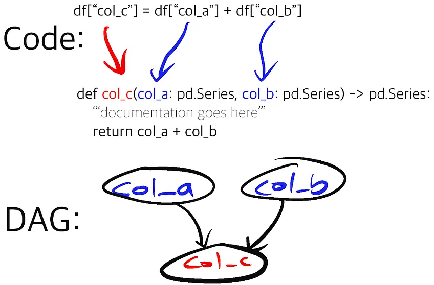
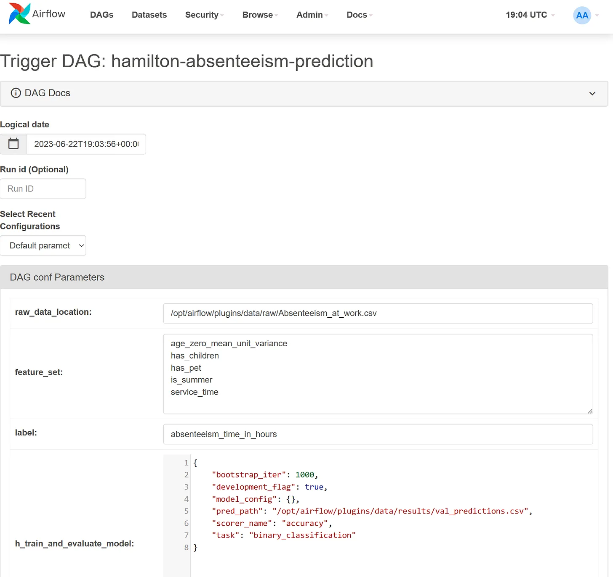
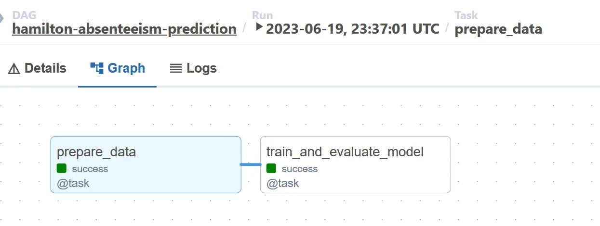
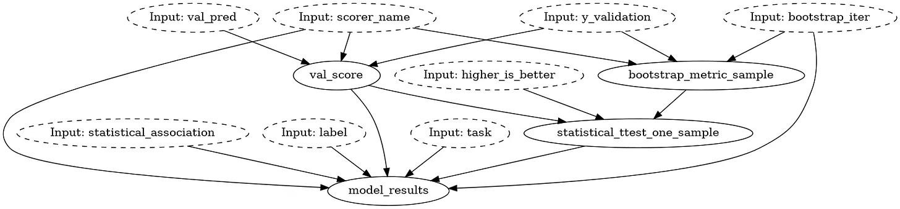

This post walks you through the benefits of having [Hamilton](https://github.com/dagworks-inc/hamilton) and [Airflow](https://airflow.apache.org/) [directed acyclic graphs](https://en.wikipedia.org/wiki/Directed_acyclic_graph) (DAGs) work in tandem. Airflow is responsible for orchestration (think macro) and Hamilton helps author clean and maintainable data transformations (think micro). The reason you can run Hamilton with Airflow, is that Hamilton is just a library with a small dependency footprint, so one can get started with Hamilton in no time! For those that are unfamiliar with Hamilton, we point you to an interactive overview on [tryhamilton.dev](tryhamilton.dev). Otherwise we will talk about Hamilton at a high level and point to reference documentation for more details.


> crosspost from https://blog.dagworks.io/p/supercharge-your-airflow-dag-with

<!--truncate-->

Airflow is the industry standard to orchestrate data pipelines. It powers all sorts of data initiatives including ETL, ML pipelines and BI. Since its inception in 2014, Airflow users have faced certain rough edges with regards to authoring and maintaining data pipelines:

* Maintainably managing the evolution of workflows; what starts simple can invariably get complex.
* Writing modular, reusable, and testable code that runs within an Airflow task.
* Tracking lineage of code and data artifacts that an Airflow DAG produces.

This is where we believe Hamilton can help! Hamilton is a Python micro-framework for writing data transformations. In short, one writes python functions in a “declarative” style, which Hamilton parses and connects into a graph based on their names, arguments and type annotations. Specific outputs can be requested and Hamilton will execute the required function path to produce them. Because it doesn’t provide macro orchestrating capabilities, it pairs nicely with Airflow by helping data professionals write cleaner code and more reusable code for Airflow DAGs.



## Write maintainable Airflow DAGs

A common use of Airflow is to help with machine learning/data science. Running such workloads in production often requires complex workflows. A necessary design decision is determining how to break up the workflow into Airflow tasks. Create too many and you increase scheduling and execution overhead (e.g. moving lots of data), create too few and you have monolithic tasks that can take a while to run, but probably are more efficient. The trade-off here is Airflow DAG complexity versus code complexity  within each of the tasks. This makes debugging and reasoning about the workflow harder, especially if you did not author the initial Airflow DAG. More often than not, the initial task structure of the Airflow DAG becomes fixed, because refactoring the task code becomes prohibitive! 

While simpler DAGs such as A->B->C are desirable, there is an inherent tension between the structure’s simplicity and the amount of code per task. The more code per task, the more difficult it is to identify points of failure, at the trade-off of potential computational efficiencies, but in the case of failures, retries grow in cost with the “size” of the task.


Instead, what if you could simultaneously wrangle the complexity within an Airflow task, no matter the size of code within it, and gain the flexibility to easily change the Airflow DAG shape with minimal effort? This is where Hamilton comes in. 

With Hamilton you can replace the code within each Airflow task with a Hamilton DAG, where Hamilton handles the “micro” orchestration of the code within the task. Note: Hamilton actually enables you to logically model everything that you’d want an Airflow DAG to do. More on that below.

To use Hamilton, you load a Python module that contains your Hamilton functions, instantiate a [Hamilton Driver](https://hamilton.dagworks.io/en/latest/concepts/driver-capabilities/) and execute a Hamilton DAG within an Airflow task in a few lines of code. By using Hamilton, you can write your data transformation at an arbitrary granularity, allowing you to inspect in greater details what each Airflow task is doing. 

Specifically the mechanics of the code are:

1. Import your function modules
2. Pass them to the Hamilton driver to build the DAG. 
3. Then, call Driver.execute() with the outputs you want to execute from the DAG you’ve defined.

Let’s look at some code that create a single node Airflow DAG but uses Hamilton to train and evaluate a ML model:

```python title="Airflow DAG with nested Hamilton"
from airflow.decorators import dag, task
from airflow.operators.python import get_current_context

# set the Airflow DAG parameters. This will appear in the Airflow UI. 
DEFAULT_DAG_PARAMS = dict(
    label="absenteeism_time_in_hours",
    feature_set=[
          "age_zero_mean_unit_variance",
          "has_children",
          "has_pet",
          "is_summer",
          "service_time",
    ],
    h_train_and_evaluate=dict(...),  # config for the Hamilton Driver
)

@dag(
    dag_id="hamilton-absenteeism-prediction",
    description="Predict absenteeism using Hamilton and Airflow",
    start_date=datetime(2023, 6, 18),
    params=DEFAULT_DAG_PARAMS,  # pass the default params to the Airflow DAG
)
def absenteeism_prediction_dag():
    """Predict absenteeism using Hamilton and Airflow"""

    # Below we have a single Airflow task that uses 2 Python modules (evaluate_model, train_model).
    # Both are loaded into the Hamilton driver in a single Airflow task, reducing the number of
    # Airflow task and preventing having to move data between the two steps. However, it remains
    # beneficial to separate the code into 2 modules since training and evaluation are independent and
    # might be reused in separate contexts.
    @task
    def train_and_evaluate_model(features_path: str):
        """Train and evaluate a machine learning model"""
        import evaluate_model  # user defined function module
        import train_model  # user defined function module

        from hamilton import base, driver

        context = get_current_context()
        PARAMS = context["params"]  # get the Airflow runtime config

        hamilton_config = PARAMS["h_train_and_evaluate_model"]
        dr = driver.Driver(
            hamilton_config,
            train_model,
            evaluate_model,  # pass function modules to the Hamilton driver
            adapter=base.SimplePythonGraphAdapter(base.DictResult()),
        )

        results = dr.execute(
            # `final_vars` specifies Hamilton functions results we want as outputs.
            final_vars=["save_validation_preds", "model_results"],
            inputs={
                "features_path": features_path,  # value retrieved from Airflow XCom
                "label": PARAMS["label"],
                "feature_set": PARAMS["feature_set"],
            },
        )
```

Now, we didn’t show the Hamilton code here, but the benefits of this approach are:

1. **Unit & integration testing.** Hamilton, through its naming and type annotations requirements, pushes developers to write modular Python code. This results in Python modules well-suited for unit testing. Once your Python code is unit tested, you can develop integration tests to ensure it behaves properly in your Airflow tasks. In contrast, testing code contained in an Airflow task is less trivial, especially in CI/CD settings, since it requires having access to an Airflow environment.

2. **Reuse data transformations.** This approach keeps the data transformations code in Python modules, separated from the Airflow DAG file. This means this code is also runnable outside of Airflow! If you come from the analytics world, it should feel similar to developing and testing SQL queries in an external .sql file, then loading it into your Airflow Postgres operators.

3. **Reorganize your Airflow DAG easily.** The lift required to change your Airflow DAG is now much lower. If you logically model everything in Hamilton, e.g. an end to end machine learning pipeline, it’s just a matter of determining how much of this Hamilton DAG needs to be computed in each Airflow task. For example, you change the number of tasks from one monolithic Airflow task, to a few, or to many — all that would need to change is what you request from Hamilton since your Hamilton DAG needn’t change at all!

## Iterative development with Hamilton & Airflow

In most data science projects, it would be impossible to write the DAG of the final system from day 1 as requirements will change. For example, the data science team might want to try different feature sets for their model. Until the list is set and finalized, it is probably undesirable to have the feature set in your source code and under version control; configuration files would be preferable.

Airflow supports default and runtime DAG configurations and will log these settings to make every DAG run reproducible. However, adding configurable behaviors will require committing adding conditional statements and complexity to your Airflow task code. This code might become obsolete during the project or only be useful in particular scenarios, ultimately decreasing your DAGs readability.

In contrast, Hamilton can use Airflow’s runtime configuration to execute different data transformations from the function graph on the fly. This layered approach can greatly increase the expressivity of Airflow DAGs while maintaining structural simplicity. Alternatively, Airflow can [dynamically generate new DAGs](https://airflow.apache.org/docs/apache-airflow/stable/howto/dynamic-dag-generation.html) from configurations, but this could decrease observability and some of these features remain experimental.



If you work in a hand-off model, this approach promotes a separation of concerns between the data engineers responsible for the Airflow production system and the data scientists in charge of developing business solutions by writing Hamilton code. Having this separation can also improve data consistency and reduce code duplication. For example, a single Airflow DAG can be reused with different Hamilton modules to create different models. Similarly, the same Hamilton data transformations can be reused across different Airflow DAGs to power dashboards, API, applications, etc.

Below are two pictures. The first illustrates the high-level Airflow DAG containing 2 nodes. The second displays the low-level Hamilton DAG of the Python module `evaluate_model` imported in the Airflow task `train_and_evaluate_model`.





## Handling data artifacts

Data science projects produce a large number of data artifacts from datasets, performance evaluations, figures, trained models, etc. The artifacts needed will change over the course of the project life cycle (data exploration, model optimization, production debugging, etc.). This is a problem for Airflow since removing a task from a DAG will delete its metadata history and break the artifact lineage. In certain scenarios, producing unnecessary or redundant data artifacts can incur significant computation and storage costs.

Hamilton can provide the needed flexibility for data artifact generation through its [data saver API](https://hamilton.dagworks.io/en/latest/reference/decorators/save_to/). Functions decorated with `@save_to.*` add the possibility to store their output, one need only to request this functionality via `Driver.execute()`. In the code below, calling `validation_predictions_table` will return the table whereas calling the `output_name_` value of `save_validation_predictions` will return the table and save it to `.csv`.

```python title="Saving data artifacts with Hamilton"
# from the function  module
@save_to.csv(path=source("pred_path"), output_name_="save_validation_predictions")
def validation_predictions_table(y_validation: np.ndarray, val_pred: np.ndarray) -> pd.DataFrame:
    """Create a table with the model's predictions on the validation set"""
    return pd.DataFrame({"y_validation": y_validation, "val_pred": val_pred})
  
# from the main process
results = dr.execute(
  final_vars=[ 
    "validation_predictions_table",  # the function name
    "save_validation_predictions",  # the decorator `output_name_` argument
  ]
)
```

This added flexibility allows users to easily toggle the artifacts generated and it can be done directly through the Airflow runtime configuration, without editing the Airflow DAG or Hamilton modules.

Furthermore, the fine-grained Hamilton function graph allows for precise data lineage & provenance. Utility functions `what_is_downstream_of()` and `what_is_upstream_of()` help visualize and programmatically explore data dependencies. Hamilton co-creator, Stefan Krawczyk, goes into detail [here](https://blog.dagworks.io/p/lineage-hamilton-in-10-minutes-c2b8a944e2e6).

## An example to get started

To help you get up and running, we have an example on how to use Hamilton with Airflow in the Hamilton GitHub repository (find it [here](https://github.com/DAGWorks-Inc/hamilton/tree/main/examples/airflow)). The README will indicate how to set up Airflow with Docker. The example contains two Airflow DAGs, one showcasing a basic Hamilton “how-to” and the other a more complete ML project example. If you have questions or need help - please join our [Slack](https://hamilton-opensource.slack.com/join/shared_invite/zt-1bjs72asx-wcUTgH7q7QX1igiQ5bbdcg#/shared-invite/email). 


Otherwise, to learn more about Hamilton’s features and functionality, please consult the documentation.

## References

* [Hamilton + Airflow example](https://github.com/DAGWorks-Inc/hamilton/tree/main/examples/airflow)
* [Hamilton Documentation](https://hamilton.dagworks.io/)
* [tryhamilton.dev](https://www.tryhamilton.dev/) — an interactive way to learn more about Hamilton.
* For another orchestration system integrating with Hamilton, you can checkout [Hamilton + Metaflow](https://outerbounds.com/blog/developing-scalable-feature-engineering-dags/).
* [Hamilton Slack community](https://hamilton-opensource.slack.com/join/shared_invite/zt-1bjs72asx-wcUTgH7q7QX1igiQ5bbdcg#/shared-invite/email)