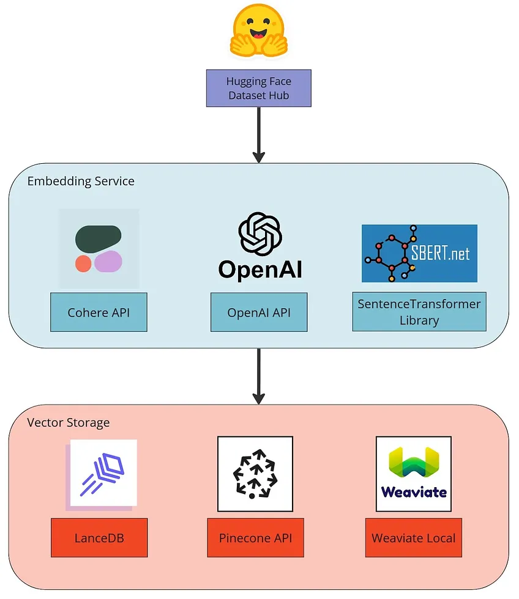
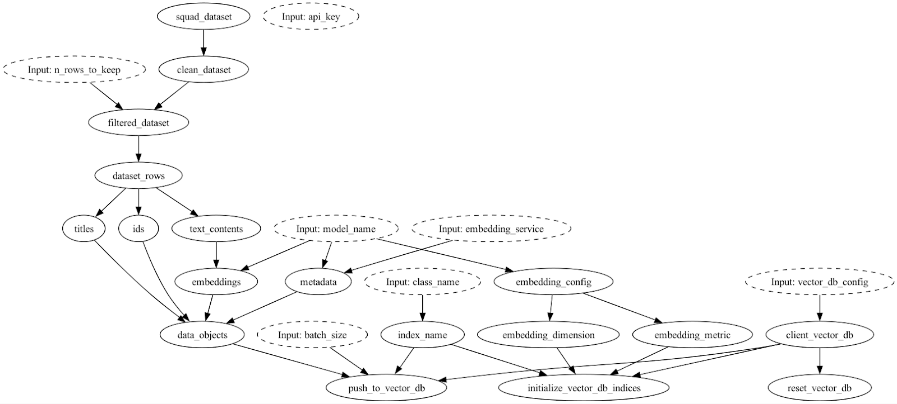
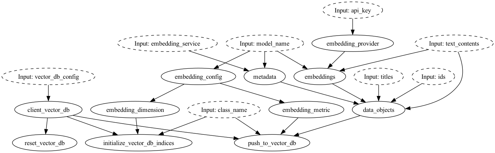

In this post, we’re going to share how [Hamilton](https://github.com/dagWorks-Inc/hamilton) can help you write modular and maintainable code for your large language model (LLM) application stack. Hamilton is great for describing any type of [dataflow](https://en.wikipedia.org/wiki/Dataflow), which is exactly what you’re doing when building an LLM powered application. With Hamilton you get strong [software maintenance ergonomics](https://ceur-ws.org/Vol-3306/paper5.pdf), with the added benefit of being able to easily swap and evaluate different providers/implementations for components of your application.

> crosspost from https://blog.dagworks.io/p/building-a-maintainable-and-modular

<!--truncate-->

The example we’ll walk through will mirror a typical LLM application workflow you’d run to populate a vector database with some text knowledge. Specifically, we’ll cover pulling data from the web, creating text embeddings (vectors) and pushing them to a vector store.



## The LLM application dataflow

To start, let’s describe what a typical LLM dataflow consists of. The application will receive a small data input (e.g., a text, a command) and act within a larger context (e.g., chat history, documents, state). This data will move through different services (LLM, vector database, document store, etc.) to perform operations, generate new data artifacts, and return final results. Most use cases repeat this flow multiple times while iterating over different inputs.

Some common operations include:
* Convert text to embeddings
* Store / search / retrieve embeddings
* Find nearest neighbors to an embedding
* Retrieve text for an embedding
* Determine context required to pass into a prompt
* Prompt models with context from relevant text
* Send results to another service (API, database, etc.)
* …
* and chaining them together!

Now, let’s think about the above in a production context, and imagine a user is unsatisfied with the outputs of your application and you want to find the root cause of the issue. Your application logged both the prompt and the results. Your code allows you to figure out the sequence of operations. Yet, you have no clue where things went wrong and the system produced undesirable output… To mitigate this, we’d argue it’s critical then to have lineage of data artifacts and the code that produces them, so you can debug situations such as these quickly.

To add to the complexity of your LLM application dataflow, many operations are non-deterministic, meaning you can’t rerun or reverse engineer the operation to reproduce intermediate results. For example, an API call to generate a text or image response will likely be non-reproducible even if you have access to the same input and configuration (you can mitigate some of this with options such as [temperature](https://platform.openai.com/docs/api-reference/chat/create#chat/create-temperature)). This also extends to certain vector database operations like “find nearest” where the result depends on the objects currently stored in the database. In production settings, it is prohibitive to near impossible to snapshot DB states to make calls reproducible.

---

For these reasons, it is important to adopt flexible tooling to create robust dataflows that allow you to:

1. plugin in various components easily.
2. see how components connect to each other.
3. add and customize common production needs like caching, validation, and observability.
4. adjust the flow structure to your needs without requiring a strong engineering skill set
5. plug into the traditional data processing and machine learning ecosystem.

In this post we’ll give an overview of how Hamilton fulfills points 1, 2, & 4. We refer the user to our [documentation](https://hamilton.dagworks.io/en/latest/) for points 3 & 5.

## Current LLM application development tooling

The LLM space is still in its infancy, and the usage patterns and tooling are rapidly evolving. While LLM frameworks can get you started, current options are not production tested; to our knowledge, no established tech companies are using the current popular LLM frameworks in production.

Don’t get us wrong, some of the tooling out there is great for getting a quick proof of concept up and running! However, we feel they fall short in two specific areas:

1. **How to model the LLM application’s dataflow**. We strongly believe that the dataflow of “actions” is better modeled as functions, rather than through object oriented classes and lifecycles. Functions are much simpler to reason about, test, and change. Object oriented classes can become quite opaque and impose more mental burden.

> When something errors, object-oriented frameworks require you to drill into the objects’ source code to understand it. Whereas with Hamilton functions, a clear dependency lineage tells you where to look and helps you reason about what happened (more on this below)!

2. **Customization/extensions**. Unfortunately you need a strong software engineering skill set to modify the current frameworks once you step outside the bounds of what they make “easy” to do. If that’s not an option, this means you can end up stepping outside the framework for a particular piece of custom business logic, which can inadvertently lead you to maintaining more code surface area than if you didn’t use the framework in the first place.

For more on these two points we point you to threads such as these two ([HackerNews](https://news.ycombinator.com/item?id=36645575#36647985), [Reddit](https://old.reddit.com/r/LangChain/comments/13fcw36/langchain_is_pointless/)) that have users speak in more detail.

While Hamilton is not a complete replacement for current LLM frameworks (e.g. there is no “agent” component), it does have all the building blocks to meet your LLM application needs and both can work in conjunction. If you want a clean, clear, and customizable way to write production code, integrate several LLM stack components, and gain observability over your app, then let’s move onto the next few sections!

## Building with Hamilton

Hamilton is a declarative micro-framework to describe [dataflows](https://en.wikipedia.org/wiki/Dataflow) in Python. It’s not a new framework (3.5+ years old), and has been used for years in production modeling data & machine learning dataflows. Its strength is expressing the flow of data & computation in a way that is straightforward to create and maintain (much like DBT does for SQL), which lends itself very well to support modeling the data & computational needs of LLM applications.


The basics of Hamilton are simple, and it can be extended in quite a few ways; you don't have to know Hamilton to get value out of this post, but if you're interested, check out:

* [tryhamilton.dev](https://www.tryhamilton.dev/) – an interactive tutorial in your browser!
* [Pandas data transformations in Hamilton in 5 minutes](https://towardsdatascience.com/how-to-use-hamilton-with-pandas-in-5-minutes-89f63e5af8f5)
* [Lineage + Hamilton in 10 minutes](https://blog.dagworks.io/p/lineage-hamilton-in-10-minutes-c2b8a944e2e6)
* [Hamilton + Airflow for production](https://blog.dagworks.io/publish/post/130538397)

## Onto our example

To help set some mental context, picture this. You’re a small data team that is tasked with creating an LLM application to “chat” with your organization’s document. You believe it’s important to evaluate candidate architectures in terms of features, performance profile, licenses, infrastructure requirements, and costs. Ultimately, you know your organization’s primary concern is providing the most relevant results and a great user experience. The best way to assess this is to build a prototype, test different stacks and compare their characteristics and outputs. Then when you transition to production, you’ll want confidence that the system can be maintained and introspected easily, to consistently provide a great user experience.

With that in mind, in this example, we will implement part of an LLM application, specifically the data ingestion step to index a knowledge base, where we convert text to embeddings and store them in a vector database. We implement this in a modular with a few different services/technologies. The broad steps are:

1. Load the [SQuAD dataset](https://huggingface.co/datasets/squad) from the HuggingFace Hub. You would swap this out for your corpus of preprocessed documents.
2. Embed text entries using the [Cohere API](https://docs.cohere.com/reference/embed), the [OpenAI API](https://platform.openai.com/docs/api-reference/embeddings), or the [SentenceTransformer library](https://www.sbert.net/examples/applications/computing-embeddings/README.html). 
3. Store embeddings in a vector database, either [LanceDB](https://lancedb.github.io/lancedb/), [Pinecone](https://docs.pinecone.io/docs/overview), or [Weaviate](https://weaviate.io/developers/weaviate).

If you need to know more about embeddings & search, we direct readers to the following links:

* [Text embeddings explained - Weaviate](https://weaviate.io/blog/vector-embeddings-explained)
* [How-to conduct semantic search with Pinecone](https://docs.pinecone.io/docs/semantic-text-search)

---

As we’re walking through this example, it would be useful for you to think about/keep in mind the following:

* **Compare what we show you with what you’re doing now**. See how Hamilton enables you to curate and structure a project without needing an explicit LLM-centric framework. 
* **Project and application structure**. Understand how Hamilton enforces a structure that enables you to build and maintain a modular stack.
* **Confidence in iteration & project longevity**. Combining the above two points, Hamilton enables you to more easily maintain an LLM application in production, no matter who authored it.

Let’s start with a visualization to give you an overview of what we’re talking about:



Here’s what the LLM Application dataflow would look like when using pinecone with sentence transformers. With Hamilton to understand how things connect is just as simple as `display_all_functions()` call on the [Hamilton driver object](https://hamilton.dagworks.io/en/latest/reference/drivers/Driver/#hamilton.driver.Driver.display_all_functions).

## Modular Code

Let’s explain the two main ways to implement modular code with Hamilton using our example for context.

### @config.when
Hamilton’s focus is on readability. Without explaining what `@config.when` does, you can probably tell that this is a conditional statement, and only included when the predicate is satisfied. Below you will find the implementation for converting text to embeddings with the OpenAI and the Cohere API.

Hamilton will recognize two functions as alternative implementations because of the `@config.when` decorator and the same function name `embeddings` preceding the double underscore (`__cohere`, `__openai`). Their function signatures need not be entirely the same, which means it's easy and clear to adopt different implementations.

```python title="Modularity via @config.when"
# functions from the same file; embedding_module.py

@config.when(embedding_service="openai")
def embeddings__openai(
    embedding_provider: ModuleType,
    text_contents: list[str],
    model_name: str = "text-embedding-ada-002",
) -> list[np.ndarray]:
    """Convert text to vector representations (embeddings) using OpenAI Embeddings API
    reference: https://github.com/openai/openai-cookbook/blob/main/examples/Get_embeddings.ipynb
    """
    response = embedding_provider.Embedding.create(input=text_contents, engine=model_name)
    return [np.asarray(obj["embedding"]) for obj in response["data"]]


@config.when(embedding_service="cohere")
def embeddings__cohere(
    embedding_provider: cohere.Client,
    text_contents: list[str],
    model_name: str = "embed-english-light-v2.0",
) -> list[np.ndarray]:
    """Convert text to vector representations (embeddings) using Cohere Embed API
    reference: https://docs.cohere.com/reference/embed
    """
    response = embedding_provider.embed(
        texts=text_contents,
        model=model_name,
        truncate="END",
    )
    return [np.asarray(embedding) for embedding in response.embeddings]
```

For this project, it made sense to have all embedding services implemented in the same file with the `@config.when` decorator since there are only 3 functions per service. However, as the project grows in complexity, functions could be moved to separate modules too, and the next section’s modularity pattern employed instead. Another point to note is that each of these functions is independently unit-testable. Should you have specific needs, it’s straightforward to encapsulate it in the function and test it.

### Switching out python modules

Below you will find the implementation of vector database operations for Pinecone and Weaviate. Note that the snippets are from `pinecone_module.py` and `weaviate_module.py` and notice how function signatures resemble and differ.

```python title="Modularity via Python modules
# functions from pinecone_module.py
from types import ModuleType

import numpy as np
import pinecone

def client_vector_db(vector_db_config: dict) -> ModuleType:
    """Instantiate Pinecone client using Environment and API key"""
    pinecone.init(**vector_db_config)
    return pinecone
  
def data_objects(
    ids: list[str], titles: list[str], embeddings: list[np.ndarray], metadata: dict
) -> list[tuple]:
    """Create valid pinecone objects (index, vector, metadata) tuples for upsert"""
    assert len(ids) == len(titles) == len(embeddings)
    properties = [dict(title=title, **metadata) for title in titles]
    embeddings = [x.tolist() for x in embeddings]
    return list(zip(ids, embeddings, properties))

def push_to_vector_db(
    client_vector_db: ModuleType,
    index_name: str,
    data_objects: list[tuple],
    batch_size: int = 100,
) -> int:
    """Upsert objects to Pinecone index; return the number of objects inserted"""
    pinecone_index = pinecone.Index(index_name)

    for i in range(0, len(data_objects), batch_size):
        i_end = min(i + batch_size, len(data_objects))

        pinecone_index.upsert(vectors=data_objects[i:i_end])
    return len(data_objects)
  

# from weaviate_module.py
import numpy as np
import weaviate

def client_vector_db(vector_db_config: dict) -> weaviate.Client:
    """Instantiate Weaviate client using Environment and API key"""
    client = weaviate.Client(**vector_db_config)
    if client.is_live() and client.is_ready():
        return client
    else:
        raise ConnectionError("Error creating Weaviate client")
    
def data_objects(
    ids: list[str], titles: list[str], text_contents: list[str], metadata: dict
) -> list[dict]:
    """Create valid weaviate objects that match the defined schema"""
    assert len(ids) == len(titles) == len(text_contents)
    return [
        dict(squad_id=id_, title=title, context=context, **metadata)
        for id_, title, context in zip(ids, titles, text_contents)
    ]

def push_to_vector_db(
    client_vector_db: weaviate.Client,
    class_name: str,
    data_objects: list[dict],
    embeddings: list[np.ndarray],
    batch_size: int = 100,
) -> int:
    """Push batch of data objects with their respective embedding to Weaviate.
    Return number of objects.
    """
    assert len(data_objects) == len(embeddings)
    with client_vector_db.batch(batch_size=batch_size, dynamic=True) as batch:
        for i in range(len(data_objects)):
            batch.add_data_object(
                data_object=data_objects[i], class_name=class_name, vector=embeddings[i]
            )
    return len(data_objects)
```

With Hamilton, the dataflow is stitched together using function names and function input arguments. Therefore by sharing function names for similar operations, the two modules are easily interchangeable. Since the LanceDB, Pinecone, and Weaviate implementations reside in separate modules, it reduces the number of dependencies per file and makes them shorter, improving both readability and maintainability. The logic for each implementation is clearly encapsulated in these named functions, so unit testing is straightforward to implement for each respective module. The separate modules reinforce the idea that they shouldn’t be loaded simultaneously. The Hamilton driver will actually throw an error when multiple functions with the same name are found that helps enforce this concept.

## Driver implications

The key part for running Hamilton code is the `Driver` object found in `run.py`. Excluding the code for the CLI and some argument parsing, we get:

```python title="Hamilton Driver"
config = dict(
    vector_db_config=json.loads(vector_db_config),
    embedding_service=embedding_service,  # this triggers config.when() in embedding_module
    api_key=embedding_service_api_key,
    model_name=model_name,
)

dr = driver.Driver(
    config,
    data_module,
    vector_db_module,  # pinecone_module, weaviate_module or lancedb_module
    embedding_module,  # contains cohere, openai, and sentence_transformer implementations
    adapter=base.SimplePythonGraphAdapter(base.DictResult()),
)

dr.execute(
    final_vars=["initialize_vector_db_indices", "push_to_vector_db"],
    inputs=dict(
        class_name="SQuADEntry",
    ),
)
```

The Hamilton Driver, which orchestrates execution and is what you manipulate your dataflow through, allows modularity through three mechanisms as seen in the above code snippet:

1. **Driver configuration**. this is a dictionary the driver receives at instantiation containing information that should remain constant, such as which API to use, or the embedding service API key. This integrates well with a command plane that can pass JSON or strings (e.g., a Docker container, [Airflow](https://blog.dagworks.io/publish/posts/detail/130538397), [Metaflow](https://outerbounds.com/blog/developing-scalable-feature-engineering-dags/), etc.). Concretely this is where we’d specify swapping out what embedding API to use.

2. **Driver modules**. the driver can receive an arbitrary number of independent Python modules to build the dataflow from. Here, the `vector_db_module` can be swapped in for the desired vector database implementation we’re connecting to. One can also import modules dynamically through [importlib](https://docs.python.org/3/library/importlib.html#importlib.import_module), which can be useful for development vs production contexts, and also enable a configuration driven way to changing the dataflow implementation

3. **Driver execution**. The `final_vars` parameter determines what output should be returned. You do not need to restructure your code to change what output you want to get. Let’s take the case of wanting to debug something within our dataflow, it is possible to request the output of any function by adding its name to `final_vars`. For example, if you have some intermediate output to debug, it’s easy to request it, or stop execution at that spot entirely. Note, the driver can receive inputs and overrides values when calling `execute()`; in the code above, the `class_name` is an execution time input that indicates the embedding object we want to create and where to store it in our vector database.

### Modularity Summary

In Hamilton, the key to enable swappable components is to:

1. define functions with effectively the same name and then,
2. annotate them with `@config.when` and choose which one to use via configuration passed to the driver, or,
3. put them in separate python modules and pass in the desired module to the driver.

So we’ve just shown how you can plugin, swap, and call various LLM components with Hamilton. We didn’t need to explain what an object oriented hierarchy is, nor require you to have extensive software engineering experience to follow (we hope!). To accomplish this, we just had to match function names, and their output types. We think this way of writing and modularizing code is therefore more accessible than current LLM frameworks permit.

## Hamilton code in practice

To add to our claims, here a few practical implications of writing Hamilton code for LLM workflows that we’ve observed:

### CI/CD
This ability to swap out modules/`@config.when` also means that integration testing in a CI system is straightforward to think about, since you have the flexibility and freedom to swap/isolate parts of the dataflow as desired.

### Collaboration
1. The modularity Hamilton enables can allow one to mirror cross team boundaries easily. The function names & their output types become a contract, which ensures one can make surgical changes and be confident in the change, as well as have the visibility into downstream dependencies with Hamilton’s [visualization and lineage features](https://blog.dagworks.io/p/lineage-hamilton-in-10-minutes-c2b8a944e2e6) (like the initial visualization we saw). For example, it’s clear how to interact and consume from the vector database.

2. Code changes are simpler to review, because the flow is defined by declarative functions. The changes are self-contained; because there is no object oriented hierarchy to learn, just a function to modify.  Anything “custom” is de facto supported by Hamilton.

### Debugging
When there is an error with Hamilton, it’s clear as to what the code it maps to is, and because of how the function is defined, one knows where to place it within the dataflow.

Take the simple example of the embeddings function using cohere. If there was a time out, or error in parsing the response it would be clear that it maps to this code, and from the function definition you’d know where in the flow it fits.

```python title="Cohere embedding function"
@config.when(embedding_service="cohere")
def embeddings__cohere(
    embedding_provider: cohere.Client,
    text_contents: list[str],
    model_name: str = "embed-english-light-v2.0",
) -> list[np.ndarray]:
    """Convert text to vector representations (embeddings) using Cohere Embed API
    reference: https://docs.cohere.com/reference/embed
    """
    response = embedding_provider.embed(
        texts=text_contents,
        model=model_name,
        truncate="END",
    )
    return [np.asarray(embedding) for embedding in response.embeddings]
```



## Tips for creating a modular LLM stack

Before we finish, here are some ideas to guide you through building your application. Some decisions might not have an obvious best choice, but having the right approach to modularity will allow you to efficiently iterate as requirements evolve.

1. Before writing any code, draw a DAG of the logical steps of your workflow. This sets the basis for defining common steps and interfaces that are not service-specific.

2. Identify steps that could be swapped. By being purposeful with configuration points, you will reduce risks of [speculative generality](https://refactoring.guru/smells/speculative-generality). Concretely, this would result in functions with less arguments, default values, and grouped into thematic modules.

3. Chunk parts of your dataflow into modules with few dependencies, if relevant. This will lead to shorter Python files with fewer package dependencies, improved readability and maintainability. Hamilton is indifferent and can build its DAG from multiple modules.

## To close & future directions

Thanks for getting this far. We believe that Hamilton has a part to play in helping everyone express their dataflows, and LLM applications are just one use case! To summarize our messaging in this post can be boiled down to:

1. It is useful to conceive of LLM applications as dataflows, and are therefore a great fit for using Hamilton.

2. Object-centric LLM frameworks can be opaque and hard to extend and maintain for your production needs. Instead, one should write their own integrations with Hamilton’s straightforward declarative style. Doing so will improve your code’s transparency and maintainability, with clear testable functions, clear mapping of runtime errors to functions, and built-in visualization of your dataflow.

3. The modularity prescribed by using Hamilton will make collaboration more efficient and provide you with the requisite flexibility to modify and change your LLM workflows at the speed at which the field is moving.

We now invite you to play around with, try, and modify the full example for yourselves [here](https://github.com/DAGWorks-Inc/hamilton/tree/main/examples/LLM_Workflows/modular_llm_stack). There is a `README` that will explain the commands to run and get started. Otherwise, we are working on making the Hamilton + LLM Application experience even better by thinking about the following:

1. **Agents**. Can we provide the same level of visibility to agents that we have for regular Hamilton dataflows?

2. **Parallelization**. How can we make it simpler to express running a dataflow over a list of documents for example. See this work in progress PR for what we mean.

3. **Plugins for caching and observability**. One can already implement a custom caching and observability solution on top of Hamilton. We’re working on providing more standard options out of the box for common components, e.g. redis.

4. **A user contributed dataflows section**. We see the possibility to standardize on common names for specific LLM application use cases. In which case we can start to aggregate Hamilton dataflows, and allow people to pull them down for their needs.

## We want to hear from you! 

If you’re excited by any of this, or have strong opinions, drop by our Slack channel / or leave some comments here! Some resources to get you help:

📣 join our community on [Slack](https://hamilton-opensource.slack.com/join/shared_invite/zt-1bjs72asx-wcUTgH7q7QX1igiQ5bbdcg#/shared-invite/email)  —  we’re more than happy to help answer questions you might have or get you started.

⭐️ us on [GitHub](https://github.com/DAGWorks-Inc/hamilton)

📝 leave us an [issue](https://github.com/DAGWorks-Inc/hamilton/issues) if you find something

Other Hamilton posts you might be interested in:

* [tryhamilton.dev](https://www.tryhamilton.dev/) – an interactive tutorial in your browser!
* [Pandas data transformations in Hamilton in 5 minutes](https://blog.dagworks.io/p/how-to-use-hamilton-with-pandas-in-5-minutes-89f63e5af8f5)
* [Lineage + Hamilton in 10 minutes](https://blog.dagworks.io/p/lineage-hamilton-in-10-minutes-c2b8a944e2e6)
* [Hamilton + Airflow for production](https://blog.dagworks.io/publish/post/130538397)