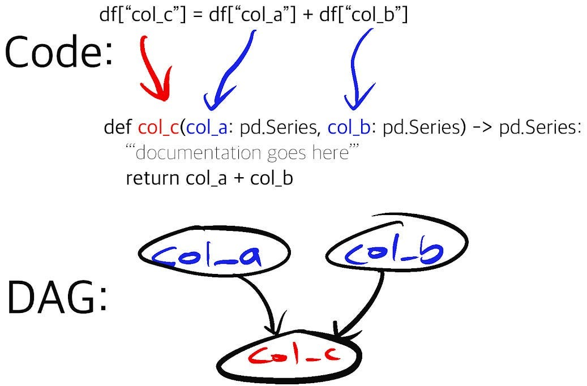
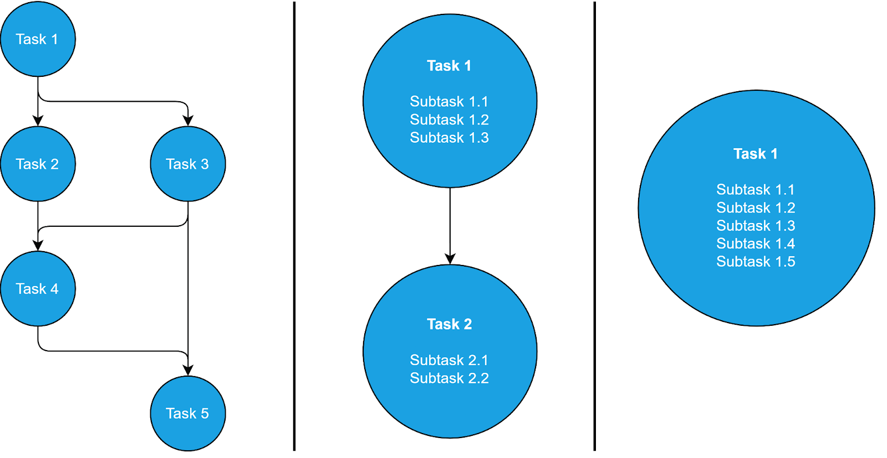
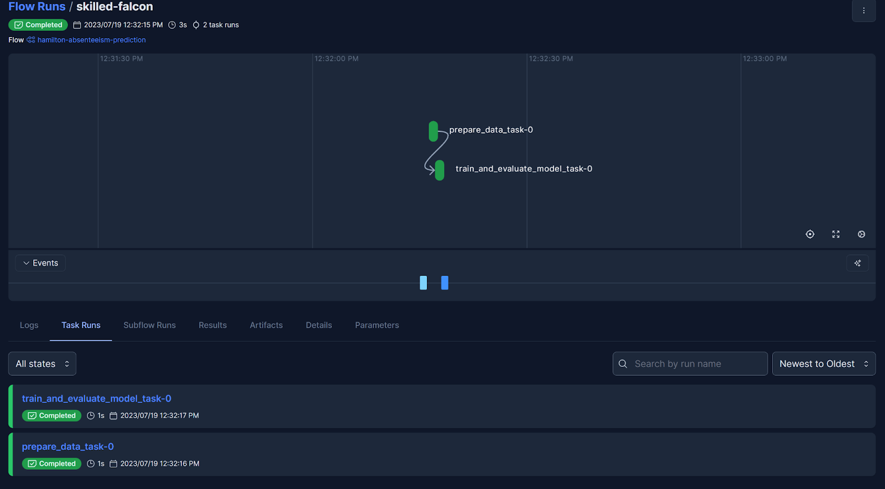
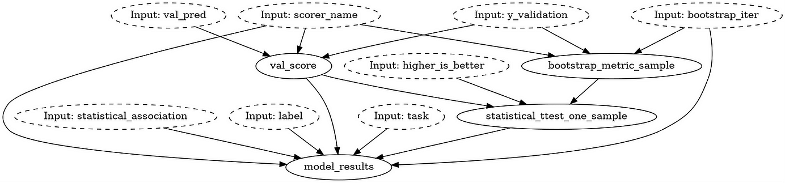

This post will show you how to use Hamilton with Prefect, two open source projects. At a high level, Prefect orchestrates where/when/what/how code runs (think macro) and Hamilton helps author clean and maintainable code for data transformations (think micro).

> crosspost from https://blog.dagworks.io/p/simplify-prefect-workflow-creation

<!--truncate-->

> If you are new to Hamilton, we invite you to an interactive overview on [tryhamilton.dev](http://www.tryhamilton.dev/), or this [post](https://towardsdatascience.com/functions-dags-introducing-hamilton-a-microframework-for-dataframe-generation-more-8e34b84efc1d). Hamilton will be discussed at a high level and relevant documentation references will be shared for more details.

[Prefect](https://docs.prefect.io/latest/) is a modern open source workflow orchestrator that uses Python. With its cloud-provider-agnostic deployment, workspaces, authentication, observability, etc., it can power any data science or machine learning project in production. That said, Prefect is not particularly focused on helping data scientists et al. write clean and maintainable workflow code, leaving users with the following challenges:

1. Maintain ever-evolving workflows; what starts simple invariably gets complex.
2. Write modular, reusable, and testable code to run within Prefect tasks.
3. Track lineage of code and data artifacts that a workflow produces.

This is where we believe Hamilton can help! [Hamilton](https://github.com/dagworks-inc/hamilton) is a Python micro-framework for writing data transformations. In short, one writes Python functions in a declarative style, which Hamilton parses and connects into a graph based on their names, arguments and type annotations. Specific outputs can be requested and Hamilton will execute the required function path to produce them. By using Prefect and Hamilton, you get a solid toolbox to orchestrate your project over cloud infrastructure, and benefit from easier to reuse and maintain workflow components.



## Write maintainable Prefect workflows

A key decision in building a Prefect workflow is “[how big should a task be](https://docs.prefect.io/2.10.21/concepts/tasks/#tasks-overview)” and how to divide a project into flows and tasks for execution. Each function decorated with the Prefect `@task` decorator gains support for caching and retries, and is executed separately, but it also adds to the scheduling and execution overhead (e.g., moving lots of data). With too few tasks, you end up with a monolithic task that takes a lot of time to complete, but probably gains execution efficiency. There is a trade-off between the complexity of the macro Prefect workflow structure and the complexity of the code within each task. In either case, debugging a workflow can be difficult, especially if you are not its author since there is no standard way to write a workflow. More often than not, the initial task structure of the workflow becomes fixed by the engineering team (as they typically own this infrastructure), because refactoring the workflow without breaking things is a real challenge!

While simpler workflows such as `A->B->C` are desirable, there is an inherent tension between the structure’s simplicity and the amount of code per task. The more code per task, the more difficult it is to identify points of failure, at the trade-off of potential computational efficiencies, but in the case of failures, retries grow in cost with the size of the task.



What if you could decouple the complexity of the Prefect workflow from the complexity of the code within tasks? This becomes possible with Hamilton. No matter the size of the tasks’ code, Hamilton enables developers to iterate on the workflow with minimal effort.

Essentially, you instantiate a [Hamilton Driver](https://hamilton.dagworks.io/en/latest/concepts/driver-capabilities.html) that loads data transformations from your code modules and automatically builds a Hamilton DAG. By allowing Hamilton to handle the “micro” orchestration of your code within each Prefect task, it becomes easier to write functions at an arbitrary granularity and to inspect in greater detail the behavior of Prefect tasks.

Specifically the mechanics of the code are:

1. Import your function modules
2. Pass them to the Hamilton Driver to build the DAG.
3. Call `Driver.execute()` with the outputs you want to execute from the DAG you’ve defined.

Let’s look at some code that creates a single Prefect task, but uses Hamilton to train and evaluate a ML model:

```python title="Prefect with nested Hamilton
from hamilton import base, driver
from prefect import flow, task
from prefect.blocks.system import JSON

# import modules containing your dataflow functions
import train_model
import evaluate_model


# use the @task to define Prefect tasks, which adds logging, retries, etc.
# the function parameters define the config and inputs needed by Hamilton
@task
def train_and_evaluate_model_task(
    features_path: str,
    hamilton_config: str,
    label: str,
    feature_set: list[str],
    validation_user_ids: list[str],
) -> None:
    """Train and evaluate machine learning model"""
    # define the Driver object with configurations and modules
    dr = driver.Driver(
        hamilton_config,
        train_model,  # imported data transformation module
        evaluate_model,  # imported data transformation module
        adapter=base.SimplePythonGraphAdapter(base.DictResult()),
    )

    # execute the DAG to produce and outputs the requested `final_vars`
    dr.execute(
        final_vars=["save_validation_preds", "model_results"],
        inputs=dict(
            features_path=features_path,
            label=label,
            feature_set=feature_set,
            validation_user_ids=validation_user_ids,
        ),
    )


# use @flow to define the Prefect flow.
# the function parameters define the config and inputs needed by all tasks
# this way, we prevent having constants being hardcoded in the flow or task body
@flow(
    name="hamilton-absenteeism-prediction",
    description="Predict absenteeism using Hamilton and Prefect",
)
def absenteeism_prediction_flow(
    features_path: str = ...,
    feature_set: list[str] = [
        "age_zero_mean_unit_variance",
        "has_children",
        "has_pet",
        "is_summer",
        "service_time",
    ],
    label: str = "absenteeism_time_in_hours",
    validation_user_ids: list[str] = [...],
):
    """Predict absenteeism using Hamilton and Prefect"""
    # ... more tasks
    
    # load a Prefect Block containing the Hamilton Driver config
    hamilton_config_block = JSON.load("hamilton-train-and-evaluate-config")
    
    # call the Prefect task from the workflow
    train_and_evaluate_model_task(
        features_path=features_path,
        hamilton_config=json.load(hamilton_config_block),
        label=label,
        feature_set=feature_set,
        validation_user_ids=validation_user_ids,
    )
    
    # ... more tasks


if __name__ == "__main__":
    absenteeism_prediction_flow()
```

Now, we didn’t show the Hamilton code here, but the benefits of this approach are:

1. **Unit & integration testing**. Hamilton, through its naming and type annotations requirements, pushes developers to write modular Python code. This results in Python modules well-suited for unit testing. Once your Python code is unit tested, you can develop integration tests to ensure it behaves properly in your Prefect tasks. In contrast, because of the aforementioned task size tradeoff, directly code from a Prefect task can be less trivial. Also, the CI/CD will have to share Prefect’s dependencies.

2. **Reuse data transformations**. This approach keeps the data transformations code in Python modules, separated from the Prefect workflow file. This means this code is also runnable *outside* of Prefect! If you come from the analytics world, it should feel similar to developing and testing SQL queries in an external `.sql` file, then loading it into a Prefect Block.

3. **Reorganize your workflow easily**. The lift required to change your Prefect workflow becomes much lower. If you logically model everything in Hamilton, e.g. an end to end machine learning pipeline, it’s just a matter of determining how much of this Hamilton DAG needs to be computed in each Prefect task. For example, you change the number of tasks from one monolithic Prefect task, to a few, or to many — all that would need to change is what you request from Hamilton since your Hamilton DAG needn’t change at all!

## Iterative development with Hamilton & Prefect

In most data science projects, it would be impossible to write the DAG of the final system from day 1, as requirements will change. For example, the data science team will want to try different feature sets for their model. Until this list is finalized, it’s probably undesirable to have the feature set in your source code and under version control; configuration files would be preferable.


Prefect will log the configuration for flow and task runs (i.e., the arguments to `@flow` and `@task` decorated function) for traceability and reproducibility. Additionally, Prefect has a feature called [Blocks](https://docs.prefect.io/2.10.21/concepts/blocks/) that allows configurations, API keys, and connectors to be defined in one place and be reused across projects.  With the right configuration, Prefect allows users to build expressive workflows that easily adapt to changing feature sets, prediction targets, etc.

Prefect can achieve expressivity through [dynamic workflows](https://www.prefect.io/guide/blog/workflow-orchestration-without-dags/), a type of workflow where the task to be executed are determined during the run. It does so by allowing `if/else` statements and loops to be collected within the `@flow` definitions. Since `if/else` branches only exist as part of the flow’s code, it can become hard to build a mental model of the workflow as it increases in complexity. During the project iterations, some logical branches can become obsolete but remain hard to remove because of unclear function dependencies, ultimately decreasing maintainability.


To achieve expressivity, Hamilton relies on static DAGs. By decorating functions with `@config.when()`, the user can define logical and specify alternative implementations of a node. By loading the Python modules, the Hamilton Driver is aware of all possible functions (A, B, or even C!) and before allowing execution, resolves all @config points into a static DAG (see figure below). Calls to `Driver.execute()` operate over this fixed DAG, given the specified configuration. Additionally, Hamilton requires alternative implementations to share a name, for example `my_function__a`, `my_function__b`, making the code easy to read and test.


These features pair really well with Prefect’s configurations and Blocks. For example, one can define the configuration for the Hamilton `Driver` in a JSON Block and load it within the workflow. Ultimately, this layered approach allows for all the needed expressivity of Prefect workflows while maintaining structural simplicity.


If you work in a hand-off model, this approach promotes a separation of concerns between the data engineers responsible for the Prefect production system and the data scientists in charge of developing business solutions by writing Hamilton code. Having this separation can also improve data consistency and reduce code duplication. For example, a single Prefect workflow can be reused with different Hamilton modules to create different models. Similarly, the same Hamilton data transformations can be reused across different Prefect workflows to power dashboards, API, applications, etc.

Below are two pictures. The first illustrates the high-level Prefect workflow containing two tasks. The second displays the low-level Hamilton DAG of the Python module `evaluate_model` imported in the Prefect task `train_and_evaluate_model`.





## Handling data artifacts

Data science projects produce a large number of data artifacts from datasets, performance evaluations, figures, trained models, etc. The artifacts needed will change over the course of the project life cycle (data exploration, model optimization, production debugging, etc.). In certain scenarios, producing unnecessary or redundant data artifacts can incur significant computation and storage costs.

Hamilton provides the needed flexibility for data artifact generation through its [data saver API](https://hamilton.dagworks.io/en/latest/reference/api-reference/decorators.html#save-to). By decorating functions with `@save_to.*` you can toggle the saving of specific artifacts by changing the list of requested outputs passed to `Driver.execute()`. In the code below, calling `validation_predictions_table` will return the table whereas calling the `output_name_` value of `save_validation_predictions` will return the table and save it to `.csv`. This pattern is well-suited to work in conjunction with [Prefect Artifacts](https://docs.prefect.io/2.10.21/concepts/artifacts/#creating-link-artifacts), which allow you to tie artifacts from your runs (e.g., a model pushed to S3 or snippets of dataframes) and link them. This selective artifact generation can be managed through the Prefect Block configurations, without editing the Prefect workflow or Hamilton modules.

Furthermore, the fine-grained Hamilton function graph allows for precise data lineage & provenance. Utility functions `what_is_downstream_of()` and `what_is_upstream_of()` help visualize and programmatically explore data dependencies. We point interested readers for more detail [here](https://medium.com/towards-data-science/lineage-hamilton-in-10-minutes-c2b8a944e2e6).

## To finish & an example to get started

Hopefully by now we’ve impressed on you that combining Hamilton with Prefect will help you with Prefect’s workflow creation & maintainability challenges.

To help you get up and running, we have an [example](https://github.com/DAGWorks-Inc/hamilton/tree/main/examples/prefect) on how to use Hamilton with Prefect. It should cover all the basics that you need to get started. The README includes how to create a [free tier Prefect Cloud](https://www.prefect.io/pricing/) account and run a workflow that uses Hamilton; you can also run prefect locally without using the cloud version and link to appropriate documentation. In the example, we present a small scale machine learning project with a full end-to-end pipeline of creating features and then fitting and evaluating a model.

## We want to hear from you!

If you’re excited by any of this, or have strong opinions, drop by our Slack channel / or leave some comments here! Some resources to get you help:

📣 join our community on [Slack ](https://hamilton-opensource.slack.com/join/shared_invite/zt-1bjs72asx-wcUTgH7q7QX1igiQ5bbdcg#/shared-invite/email) —  we’re more than happy to help answer questions you might have or get you started.

⭐️ us on [GitHub](https://github.com/DAGWorks-Inc/hamilton)

📝 leave us an [issue](https://github.com/DAGWorks-Inc/hamilton/issues) if you find something

Other Hamilton posts you might be interested in:

* [tryhamilton.dev](https://www.tryhamilton.dev/) – an interactive tutorial in your browser!
* [Build a modular LLM stack with Hamilton](https://blog.dagworks.io/p/building-a-maintainable-and-modular)
* [Hamilton + Airflow](https://blog.dagworks.io/publish/post/130538397) ([GitHub repo](https://github.com/DAGWorks-Inc/hamilton/tree/main/examples/airflow))
* [Hamilton + Metaflow](https://outerbounds.com/blog/developing-scalable-feature-engineering-dags/) ([GitHub repo](https://github.com/outerbounds/hamilton-metaflow))
* [Pandas data transformations in Hamilton in 5 minutes](https://blog.dagworks.io/p/how-to-use-hamilton-with-pandas-in-5-minutes-89f63e5af8f5)
* [Lineage + Hamilton in 10 minutes](https://blog.dagworks.io/p/lineage-hamilton-in-10-minutes-c2b8a944e2e6)