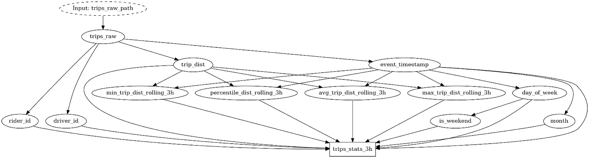
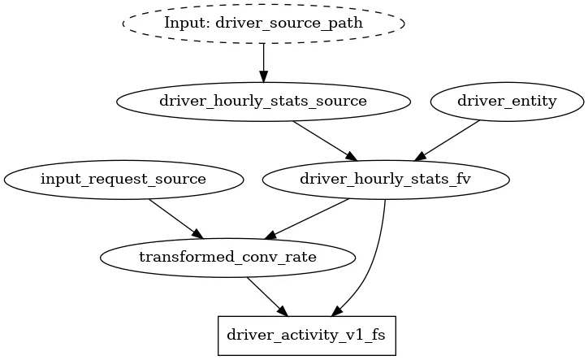
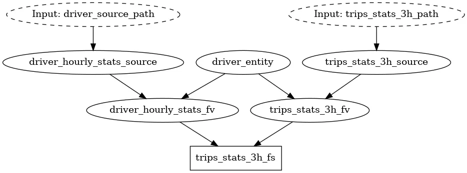

Are you using Feast? or perhaps you are having trouble with it? Or perhaps you are considering adopting it? In this post, you will learn the operational benefits of using Feast with Hamilton. Feast will act as your “feature store”, while Hamilton will be your in-process “feature processing engine”. We start by providing an overview of Feast, then show how Hamilton fits into the picture. At the end, we give a recipe for where to go from here, depending on where you are in your “feature journey”.

> crosspost from https://blog.dagworks.io/p/featurization-integrating-hamilton

<!--truncate-->

> Note: by “feature” we are referring to [this meaning of the word](https://en.wikipedia.org/wiki/Feature_(machine_learning)).

## What problem does Feast solve?

Feast is an open-source [feature store](https://www.featurestore.org/what-is-a-feature-store), a specialized piece of machine learning (ML) infrastructure that centralizes computed feature data and metadata. The feature store sits above the storage layer and unifies the output of various data sources (streaming, operational databases, data warehouse, app session, etc.) to provide a simple interface to query features for your ML application. Feature stores are critical to the operations of organizations serving high volumes of predictions (e.g., Uber, AirBnb, LinkedIn).

> Note: Feature stores introduce a lot of complexity that should be justified by a decent number of projects in production. Please read [this blog](https://medium.com/data-for-ai/feature-pipelines-and-feature-stores-deep-dive-into-system-engineering-and-analytical-tradeoffs-3c208af5e05f) by FeatureStoresForML for a detailed look at the pros and cons of feature stores. You may only need Hamilton, in which case, we direct readers to our [documentation](https://hamilton.dagworks.io/en/latest/how-tos/use-for-feature-engineering/) and [example](https://github.com/DAGWorks-Inc/hamilton/tree/main/examples/feature_engineering_multiple_contexts) to get you started!

The feature store abstraction delineates feature producers from downstream users (feature consumers), effectively creating a contract between the two parties. Feature creation and use can get messy, especially when one wants to share them across an organization. One way to do that is to centralize features via data, i.e. put them all into the same store, and users can pull from this store to power their machine learning models. A feature store can then offer guardrails to ensure that offline model training matches online settings (i.e., preventing [training/serving skew](https://developers.google.com/machine-learning/guides/rules-of-ml#training-serving_skew)). Feature stores can help reduce system latency by caching features in an “online store” (more on that below) for efficient retrieval.  This [blog](https://medium.com/@endeavordata/streamlining-machine-learning-development-with-a-feature-store-680ee6d45c64) explains further the benefits of centralizing data into a feature store.

The [Feast documentation](https://docs.feast.dev/#example-use-cases) mentions the following typical use cases:
* Personalizing online recommendations by leveraging pre-computed historical user or item features.
* Online fraud detection, using features that compare against (pre-computed) historical transaction patterns
* Credit scoring, using pre-computed historical features to compute probability of default
* Churn prediction (an offline model), generating feature values for all users at a fixed cadence in batch

## What is Feast?

If one is unfamiliar with Feast, we recommend reading the Feast [introduction page](https://docs.feast.dev/), but here are some high-level key considerations:

**What Feast does**:
* Stores metadata on features that have been registered with it
* Provides an abstraction to push to & query for materialized feature data.
* Facilitates proper [point-in-time](https://docs.feast.dev/getting-started/concepts/point-in-time-joins) (i.e., “time-travel”) table joins. Useful for creating training sets from features.
* Helps you integrate heterogeneous sources of feature data into a central place.

**What Feast doesn’t do**:
* Perform the transformations to compute your features.
* Store data itself; it relies on being set up on top of your existing infrastructure.
* Orchestrate your data transformation pipelines that would perform feature computation.
* Help you write clean transformation code & organize it.
* Provide lineage & provenance for your features.

Here are a few [Feast key terms](https://docs.feast.dev/getting-started/concepts) relevant to this post:
* **Entity**: a real-world entity we care about (e.g., user, city, month, product SKU).
* **DataSource**: a physical storage of data (e.g., file, database, data warehouse).
* **FeatureView**: the table schema of a data source with additional metadata.
* **FeatureService**: a new table schema resulting from joining one or more FeatureViews.
* **Offline store**: an interface to read DataSources and do the point-in-time joins at query time.
* **Online store**: an interface to read FeatureService already stored with the joins completed.
* **Feast registry**: the single central catalog containing the defined Feast objects and relationships.

## More on feature computation and lineage
Since Feast is only responsible for the downstream use of features, it [cannot compute them nor produce full lineage](https://docs.feast.dev/#feast-is-not) from raw data for you. Feast validates the table schema you pass to it (columns name and type), but it can’t catch upstream data transformation changes that don't respect the desired schema. 

Without lineage, it is not possible to enforce CI/CD checks of the schema and trigger a recompute of the online store when feature transformations are updated for example. Additionally, not having lineage makes it hard to trace source data usage, remove dead feature code, as well as deprecate unused features, all which are important to help ensure smooth and cost efficient operations.

## How can Hamilton help?
Hamilton is a Python micro-orchestration framework to express data transformations. It helps one write Python code that is modular and reusable, and that can be executed as a direct acyclic graph (DAG). Hamilton was initially developed and used in production to create large dataframes (100+ columns) for machine learning while preserving strong lineage capabilities (see [the origin story](https://blog.dagworks.io/p/functions-dags-introducing-hamilton-a-microframework-for-dataframe-generation-more-8e34b84efc1d)). Its strength is expressing the flow of data & computation in a way that is straightforward to create and maintain (much like DBT does for SQL). If you are considering Feast, it likely means you also have some data scale, so just to mention it, that Hamilton can be run at scale as well. It has integrations with Spark, Dask, Ray, and can even scale up your pandas code for free ([learn more here](https://hamilton.dagworks.io/en/latest/how-tos/scale-up/))!

> If you are new to Hamilton, we invite you to an interactive overview on [tryhamilton.dev](http://www.tryhamilton.dev), or this post. Hamilton will be discussed at a high level and relevant documentation references will be shared for more details.

Hamilton is a flexible tool to express DAGs and can improve the Feast development experience in two primary ways: 

1. unifying how feature transformations are defined, executed across your stack
2. define and manage the Feast objects you use to register features with Feast.


### 1. Use Hamilton for data transformations before pushing to Feast

With Hamilton, you write declarative and granular data transformation functions. The functions declare what they output with the **function name** and declare what they require as input with the **function arguments**, and everything is type annotated. The logic of the computation is wholly contained within the function. The Hamilton Driver, which orchestrates execution in a python process, automatically generates the execution DAG from the function definitions and allows you to query for only the set of transforms you are interested in computing.


Using this approach, you can easily scale to writing dataframes with 1000s of columns and maintain a clear lineage of upstream and downstream dependencies. To generate your features, simply call `Driver.execute()` and write the resulting dataframe to your Feast offline or online store. You can reuse the modular functions you define both in your offline and online environment to prevent training/serving skew.  Also, the defined Hamilton functions can be easily reused in Feast’s [OnDemandFeatureView](https://docs.feast.dev/reference/alpha-on-demand-feature-view) when dealing with request data. In addition, Hamilton enables runtime data validation on any function by adding the `@check_output` decorator ([learn more](https://hamilton.dagworks.io/en/latest/how-tos/run-data-quality-checks/)), which can again mitigate training/serving skew and ensure feature output is checked before it is pushed to Feast.

```python title="Push data to Feast"
import numpy as np
import pandas as pd

from hamilton.function_modifiers import extract_columns, save_to, source, check_output

TRIPS_SOURCE_COLUMNS = [
    "event_timestamp",
    "driver_id",
    "rider_id",
    "trip_dist",
    "created",
]


# extract columns allows you to split a dataframe into multiple pandas Series
@extract_columns(*TRIPS_SOURCE_COLUMNS)
def trips_raw(trips_raw_path: str) -> pd.DataFrame:
    """Load the driver dataset"""
    df = pd.read_parquet(trips_raw_path)
    df = df.sort_values(by="event_timestamp")
    return df


def day_of_week(event_timestamp: pd.Series) -> pd.Series:
    """Encode day of the week as int"""
    return pd.Series(
        event_timestamp.dt.day_of_week, name="day_of_week", index=event_timestamp.index
    )


# see how this function depends on the return value of `day_of_week()`
@check_output(data_type=np.int64, data_in_range(0, 1), importance="warn")
def is_weekend(day_of_week: pd.Series) -> pd.Series:
    weekend = np.where(day_of_week >= 5, 1, 0)
    return pd.Series(weekend, name="is_weekend", index=day_of_week.index)


def percentile_dist_rolling_3h(trip_dist: pd.Series, event_timestamp: pd.Series) -> pd.Series:
    """Compute the rolling 3H percentile trip dist"""
    df = pd.concat([trip_dist, event_timestamp], axis=1)
    agg = df.rolling("3H", on="event_timestamp")["trip_dist"].rank(pct=True)
    return pd.Series(agg, name="percentile_trip_dist_rolling_3h", index=event_timestamp.index)


# this function has many lines, but it simply explicitly assemble columns from the raw
# source and the computed features.
# the @save_to decorator allows to easily save this result to a parquet file
@save_to.parquet(path=source("trips_stats_3h_path"), output_name_="save_trips_stats_3h")
def trips_stats_3h(
    event_timestamp: pd.Series,
    driver_id: pd.Series,
    day_of_week: pd.Series,
    is_weekend: pd.Series,
    percentile_dist_rolling_3h: pd.Series,
) -> pd.DataFrame:
    """Global trip statistics over rolling 3h"""
    df = pd.concat(
        [
            event_timestamp,
            driver_id,
            day_of_week,
            is_weekend,
            percentile_dist_rolling_3h,
        ],
        axis=1,
    )
    return df
```

This code snippet shows broadly the Hamilton approach to defining feature transforms. There is a function that loads a dataframe and exposes its columns (i.e. individual pandas series) for downstream use; typically this could be a call to a database to return a dataframe. Then, features are created by applying functions on these pandas series. Notably, `percentile_dist_rolling_3h()` takes two pandas series as input, creates a temporary dataframe in the function’s body to apply a rolling window, and returns a new pandas series. Hamilton provides a lot of utilities to avoid code duplication across similar features. You can learn more about them from the examples in the [documentation](https://hamilton.dagworks.io/en/latest/concepts/decorators-overview/).



Hamilton pairs so well with Feast because they were both designed around the table/dataframe abstraction. Hamilton enables you to create complex dataframes using functions that are easy to read, test, and document, and you also get [lineage as code](https://blog.dagworks.io/p/lineage-hamilton-in-10-minutes-c2b8a944e2e6)! This increased visibility makes it easier for downstream Feast users to trust data definitions and therefore feature quality.

### 2. Use Hamilton to wrangle Feast definitions

Feast defines its registry objects in Python. For Feast to know about features you need to explicitly register them. At registration, when calling `feast apply` objects are converted to [protobuf](https://protobuf.dev/) and feature object relationships are built. However, the dependencies between feature objects are not made explicit from the Python code definitions that Feast makes your write. To add to this, the Feast CLI is able to read feature object definitions across directories, which inadvertently allows the proliferation of feature object definitions across a codebase. This makes it hard for someone reading the codebase to develop a mental model of these relationships. Considering Feast is essentially a DAG, wrapping object definitions in Hamilton functions can greatly improve readability and reduce the chances of breaking changes.

```python title="Define Feast entities with Hamilton
import feast
import datetime


# an entity has no upstream dependencies; it is our join index
def driver_entity() -> feast.Entity:
    """Feast definition: driver entity"""
    return feast.Entity(name="driver", join_keys=["driver_id"], value_type=feast.ValueType.INT64)
  

# the filesource only needs a file path
# it could have been hardcoded, but here we pass it as argument because we want to ensure
# that is it the same value passed as the storage for our feature_transformations.py code
def driver_hourly_stats_source(driver_source_path: str) -> feast.FileSource:
  """Feast definition: source with hourly stats of driver"""
  return feast.FileSource(
      name="driver_hourly_stats",
      path=driver_source_path,
      timestamp_field="event_timestamp",
      created_timestamp_column="created",
  )


# the FeatureView is a 1-to-1 with the DataSource, but adds metadata and time-to-live (TTL)
def driver_hourly_stats_fv(
  driver_entity: feast.Entity,
  driver_hourly_stats_source: feast.FileSource
) -> feast.FeatureView:
  """Feast definition: feature view with hourly stats of driver"""
  return feast.FeatureView(
      name="driver_hourly_stats",
      entities=[driver_entity],
      ttl=timedelta(days=1),
      schema=[
          feast.Field(name="conv_rate", dtype=feast.types.Float32),
          feast.Field(name="acc_rate", dtype=feast.types.Float32),
          feast.Field(
              name="avg_daily_trips", dtype=feast.types.Int64, description="Average daily trips"
          ),
      ],
      online=True,
      source=driver_hourly_stats_source,
      tags={"team": "driver_performance"},
  )


# the FeatureService defines how the data is stored in the online store
# and how it's retrieved
def driver_activity_v1_fs(
   driver_hourly_stats_fv: feast.FeatureView,
) -> feast.FeatureService:
    """Feast definition: grouping of features relative to driver activity"""
    return feast.FeatureService(
        name="driver_activity_v1",
        features=[
            driver_hourly_stats_fv,
        ],
    )
```

The code shows a snippet from the `store_definitions.py` file from the Feast example in the Hamilton repository. The Hamilton approach to defining functions makes it easy to read dependencies from the code and prevents synchronization issues between Feast feature object definitions when changes are made. As a bonus, Hamilton can automatically generate visualizations that you can associate with your commit or add to your documentation. Below is the DAG generated that registers the appropriate objects with Feast; Hamilton uses the functions defined in `store_definitions.py` to create this.


As the Feast object graph grows in complexity, it becomes overwhelming to display in its entirety. With the Hamilton `driver.what_is_upstream_of()` and `what_is_downstream_of()`, one can quickly answer specific questions about dependencies, by zooming into only what’s relevant to display. For example:





## The full Hamilton + Feast experience

So far, we’ve presented how to use Hamilton to compute the features used in Feast and how to define your Feast objects with Hamilton. By adopting both practices, you can gain visibility over the dataflow from raw data, to feature transformations, to Feast service, effectively extending the contract between data producers and downstream users. If downstream users also use Hamilton to express their data science workflow or power an inference API endpoint, all of the benefits will be further extended! 

This integration allows you to foresee which downstream users will be affected by changes to data transformations code and how. For example: 

1. You could add to your CI/CD pipeline checks for changes in the structure of the Hamilton transformations and Feast object definitions DAGs. If detected one could send an alert or request a review from affected users. 

2. Changes to the Hamilton DAG could trigger a purge and feature recompute for the Feast online store to prevent any mismatch between a newly trained model and the already stored features.

## Build the feature platform you need

### Step 1: Adopt Hamilton
We candidly believe that Hamilton is a great addition, no matter the stage of maturity your feature needs are in. If you have existing code, it usually only takes you 10-25% of the initial development time to refactor code into the Hamiltonian style.

### Step 2: Feature Store? 
But when to do you use/adopt Feast? That’s a different question. Feast has some compelling features, but it is important to evaluate a team’s needs and capabilities, present and future, before making important infrastructure decisions. Make sure to read this excellent [blog](https://medium.com/data-for-ai/feature-pipelines-and-feature-stores-deep-dive-into-system-engineering-and-analytical-tradeoffs-3c208af5e05f) to review the pros and cons of feature stores; as noted in the beginning, a feature store is a complex component to integrate and manage, so you should be confident in your decision before moving forward. There are two important lines of questioning:

#### Would your problems benefit from a feature store? 
This requires thinking about the nature of the problems you are working on and scoping the pain points you are facing.
* Are you integrating multiple batch/streaming/request data sources? If you are only pulling everything from a data warehouse, you might not need a feature store.
* Are you handling time-series data with complex joins and need point-in-time retrieval? If you are only doing batch predictions with a few joins, you might not need a feature store.
* Are you having duplicate definitions and compute of features across projects? 

#### What would be the cost of a maintaining feature store?
This requires evaluating the efforts and resources that will be needed to be dedicated to setting up and maintaining the feature store.
* How many features and projects in production are you actively managing?
* Do you have a dedicated team to manage infrastructure? You will need ML or data engineering time to migrate and maintain the feature store. Also, data scientists/teams that built the existing features and pipelines will need to ensure migration correctness.

## Some Illustrative scenarios

Now here are a few prototypical scenarios. You might recognize yourself in one, or find yourself between two, but in all cases remember the earlier the you adopt good coding practices and write modular code, the easiest migrating to a feature store is.

### You are just getting started with data science and machine learning and writing a proof of concept(s).

You probably do not need a feature store and its overhead before having any project in production as it would slow you down. You are however, more likely to need tooling around versioning your code and experimentation tracking to store and compare model performance and analysis results. Unlike a feature store, Hamilton is lightweight and can help you write better code that will be easier to version. You can use it from day 1 of any project. Use it to write your analysis and keep track of the results of `driver.execute()` using [MLFlow](https://mlflow.org/docs/latest/index.html), [Neptune](https://docs.neptune.ai/), or [Weights&Biases](https://docs.wandb.ai/) for example.

### You are managing a few deployed projects serving predictions to users.
This is typically when people start looking at tooling to standardize development across projects to reduce duplicated effort and bring some centralization for people to build off of collectively. After answering the above questions, you might conclude that you need a feature store.

If you have the resources to migrate to a feature store, the earlier you migrate the less refactoring you have to do. If you currently don’t have the bandwidth, you can still standardize your practice moving forward and progressively refactor code to prepare for a migration.

### You have multiple mature projects serving a large number of predictions.
As the size and maturity of your data science and ML practice increases, the same logic as the previous section applies, but the cost/benefit ratio can change. The potential benefits are likely evident to you, but refactoring projects powering production services can be risky and very demanding. You should prioritize projects and migrate them one at a time. Adding data validation for data transformations,  Feast ingest, Feast retrieval and model predictions will help prevent breaking changes and diagnose potential problems. 

## You decided to migrate to Feast
To help, we recommend that data scientists/teams responsible for the projects help with the migration. They will need to specify the entities and the timestamp columns for joins. Then, they should define the meaning of features to include in the Feast registry and refactor code to extract the data transformation functions. If you are not already using Hamilton, the refactoring could be more involved.

With that information, you should be able to write the Feast definitions DAG and register it. If the Feast objects were properly defined, retrieving features from Feast should be equivalent to your previous pipeline on downstream operations.  Then, you should test if you are able to properly materialize/push new data to the online and offline stores.

## You decided not to migrate/adopt to Feast (yet?)
You might have realized that your projects wouldn’t benefit from Feast or that more important pain points need to be addressed. Here’s a few examples:

* You want lineage → Hamilton’s DAG-based paradigm is ideal to clearly establish the dependencies between transformations and the steps data goes through. See [DAGWorks](http://www.dagworks.io) that takes this product experience further. 
* You need to automate tasks or run things on a schedule → look into orchestrators. Hamilton integrates well with any of them, including [Airflow](https://blog.dagworks.io/p/supercharge-your-airflow-dag-with), [Prefect](https://blog.dagworks.io/p/simplify-prefect-workflow-creation), and [Metaflow](https://github.com/outerbounds/hamilton-metaflow).
* You need to gain visibility over production systems failures → look into Hamilton’s data quality capabilities, and other monitoring tools like [DAGWorks](http://www.dagworks.io). 
* You need to share results and collaborate with team members → look into experiment tracking platforms.

## Final words
Having Hamilton + Feast in your stack will quickly feel natural. Together, they improve operational efficiency by enabling you to standardize & centralize feature transformations, feature registration, storage and retrieval. So not only will teams be able to create training sets from each others’ features, they will also be able to trace what data produced it and how it was transformed to more easily trust and mitigate data issues. Altogether this will mean that teams will move faster with more confidence.

Simply fork the example [repository for Feast + Hamilton](https://github.com/DAGWorks-Inc/hamilton/tree/main/examples/feast) to get started! It will give you an idea how to: structure your directory, write Hamilton data transformations, define Feast objects, and retrieve features from Feast. 

For users who have questions on the above, please reach out to us on Slack! We’re also more than happy to consult on Feast matters.

## Links

🔗 Join our community on [Slack](https://hamilton-opensource.slack.com/join/shared_invite/zt-1bjs72asx-wcUTgH7q7QX1igiQ5bbdcg#/shared-invite/email).

⭐️ Leave us a star on [GitHub](https://github.com/DAGWorks-Inc/hamilton).

⌨️ Try Hamilton in the browser at [tryhamilton.dev](https://tryhamilton.dev).

Integrate Feast and Hamilton: example [GitHub repository](https://github.com/DAGWorks-Inc/hamilton/tree/main/examples/feast).

Read: [Writing tidy production Pandas code with Hamilton](https://blog.dagworks.io/p/tidy-production-pandas-with-hamilton-3b759a2bf562) .

Read: [An hands-on and succinct introduction to feature stores and Feast by MadeWithML](https://madewithml.com/courses/mlops/feature-store/#when-do-i-need-a-feature-store).

Integrate Hamilton with your favorite macro-orchestrator: [Airflow](https://blog.dagworks.io/publish/post/130538397), [Prefect](https://substack.com/inbox/post/135342200), [Metaflow](https://outerbounds.com/blog/developing-scalable-feature-engineering-dags/).

