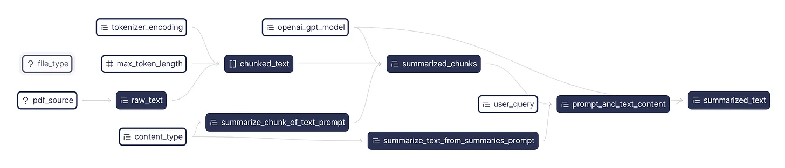

Skip learning convoluted LLM-specific frameworks and write your first LLM application using regular Python functions and [Hamilton](https://github.com/dagWorks-Inc/hamilton)! In this post, we’ll present a containerized PDF summarizer powered by the [OpenAI API](https://platform.openai.com/docs/api-reference). Its flow is encoded in Hamilton, which the [FastAPI](https://fastapi.tiangolo.com/) backend runs and exposes as an inference endpoint. The lightweight frontend uses [Streamlit](https://docs.streamlit.io/) and exercises the backend. ([GitHub repo](https://github.com/DAGWorks-Inc/hamilton/tree/main/examples/LLM_Workflows/pdf_summarizer))


> crosspost from https://blog.dagworks.io/p/containerized-pdf-summarizer-with

<!--truncate-->

## The first generation of large language models applications
Large language models (LLMs) open up new opportunities to exploit unstructured text data and ways to interact with the computer, such as chat-based information retrieval, writing assistance, or text summarization. These models can complete many different tasks that need to be specified via a text prompt. This flexibility in terms of input and output differs from previous ML/AI initiatives in industry (e.g., forecasting, recommender systems, computer vision) that had precisely defined inputs and outputs formats. It is one of the central [challenges and complexities](https://huyenchip.com/2023/04/11/llm-engineering.html) introduced by LLMs, and furthers the need for traceability and validation steps for data pipelines.

Accordingly, the tooling to solve these problems is nascent and changes rapidly. Not only is the best development paradigm undefined, it is a moving target since LLMs themselves are evolving. Building an application using LLMs today will almost certainly lead to dealing with breaking changes or migrations around the LLM APIs, prompt versioning, context management, storage infrastructure (e.g., vector databases), monitoring frameworks, and other service vendors.

In their current state, the available LLM frameworks might get you up and running, but are missing the modularity and the transparency required for a proper software development lifecycle that considers production operations.

* How do you iterate & test the behavior of new prompts and version them?
* Do you version your prompt with the code & LLM used? How coupled are they?
* How do you run your workflows in a batch setting without a web-server?
* How do you monitor your system’s performance and data artifacts produced without slowing down your development cycle?
* How do you structure a readable codebase that facilitates collaboration and allows you to understand the impacts of changes on your various workflows?

We’ll explore through a series of posts how to overcome these challenges when adding LLM capabilities into your application. In this article, we ground the discussion around a PDF summarizer and future posts will extend the example with testing, Spark support, lineage, etc. **Subscribe to get updates as we publish them**!

# Introducing Hamilton
LLMs-based applications can be expressed as [dataflows](https://en.wikipedia.org/wiki/Dataflow_programming), which boils down to modeling your program by focusing on the moving of data artifacts (prompts, context, knowledge base, generated response, etc.) with computation (what you do with the data).

[Hamilton](https://github.com/dagWorks-Inc/hamilton) is a declarative micro-framework to describe dataflows in Python. Its strength is expressing the flow of data and computation in a straightforward and easy to maintain manner (much like dbt does for SQL). It has minimal dependencies and can run anywhere Python runs, meaning the same code will work in development notebooks, scripts, Spark clusters, or production web-services. Hamilton is not a new framework (3.5+ years old), and has been used for years in production modeling data & machine learning dataflows.


The picture above encapsulates the function-centric declarative approach of Hamilton. The function’s name is tied to its outputs and its arguments define what data it depends on. This allows Hamilton to read functions found in a module and automatically generate the DAG to be executed. This paradigm incentivizes developers to write small modular functions instead of scripts or larger functions, without sacrificing iteration speed. As a result, it is easier to:

* Read and understand the codebase
* Edit implementations and extend your business logic
* Do data validation after key steps
* Understand downstream consequences of changes
* Unit test and prevent breaking changes
* Reuse functions or groups of functions across projects
* Add in platform concerns independent of the logic encoded with Hamilton.

Again, to keep this post short and focused, we won’t dive into how to do all the above.

> If you have never tried Hamilton, feel free to visit our interactive browser demo at: https://www.tryhamilton.dev/

## Hamilton for LLM and NLP flows
Given the rapid progress in the LLM and tooling space, adopting a low abstraction framework like Hamilton for your application facilitates writing a modular and well-tested codebase, as well as a straightforward approach to versioning flows. Having your focus on modularity early on will facilitate future upgrades and migrations, and allow you to keep up with state-of-the-art without breaking production.

For LLM applications, being able to reuse code logic between development (e.g. notebooks, scripts) and production services (FastAPI, serverless services, Spark) has a large positive impact on development speed. Also, Hamilton decouples your LLM dataflow logic from your service/platform concerns. For example, the caching of OpenAI requests, application scaling, or monitoring, are platform concerns and should be separated as such. This decoupling is also helpful in a hand-off model if you operate in one; data scientists work on Hamilton modeling logic while engineers handle ensuring it runs with the appropriate monitoring in production. As you read this post, we invite you to think about how the code we show might develop and evolve in your organization – leave us a comment afterwards with your thoughts/reactions.

## Building a modular PDF summarizer application


At the core, the application loads a PDF as text, chunks it, and calls the [OpenAI API](https://platform.openai.com/docs/api-reference) to summarize the chunks and reduces them into a single summary. It is packaged as a frontend and a backend container using docker-compose. The frontend uses [Streamlit](https://docs.streamlit.io/), a library to write web UI using Python. When clicking on the `Summarize` button (see introduction image), an `HTTP POST` request `/summarize_sync` is made to the FastAPI backend. [FastAPI](https://fastapi.tiangolo.com/) is a library to create REST API endpoints to communicate with a server. When receiving the `/summarize_sync` request, the endpoint executes the relevant operation via an Hamilton driver instantiated on the server.

> [Find the code on GitHub](https://github.com/DAGWorks-Inc/hamilton/tree/main/examples/LLM_Workflows/pdf_summarizer)

First, let’s look at the directory structure:
```title="Directory structure"
.
├── README.md
├── docker-compose.yaml
├── backend
│   ├── Dockerfile
│   ├── requirements.txt
│   ├── server.py
│   └── summarization.py
└── frontend
    ├── Dockerfile
    ├── requirements.txt
    └── app.py
```
At a high-level, the frontend and the backend are in separate folders, each with their own `Dockerfile` and `requirements.txt`. The backend has `server.py` which contains the FastAPI endpoints definition and the calls to the Hamilton driver, while `summarization.py` contains the dataflow logic used by the `Hamilton Driver`. If you’re coming from LangChain, you can think of `summarization.py` as the implementation of a more [modular chain](https://python.langchain.com/docs/modules/chains/). The directory structure should feel natural and intuitive, making it easy to understand for any junior colleague joining your team.

--- 
Now, let’s look at snippets of `summarization.py` and then `server.py` powering the backend:
```python title="Hamilton dataflows"
# summarization.py
# ... imports 

def summarize_chunk_of_text_prompt(content_type: str = "an academic paper") -> str:
    """Base prompt for summarizing chunks of text."""
    return f"Summarize this text from {content_type}. Extract any key points with reasoning.\n\nContent:"

  
def summarize_text_from_summaries_prompt(content_type: str = "an academic paper") -> str:
    """Prompt for summarizing a paper from a list of summaries."""
    return f"""Write a summary collated from this collection of key points extracted from {content_type}.
    The summary should highlight the core argument, conclusions and evidence, and answer the user's query.
    User query: {{query}}
    The summary should be structured in bulleted lists following the headings Core Argument, Evidence, and Conclusions.
    Key points:\n{{results}}\nSummary:\n"""


@config.when(file_type="pdf")
def raw_text__pdf(pdf_source: str | bytes | tempfile.SpooledTemporaryFile) -> str:
    """Takes a filepath to a PDF and returns a string of the PDF's contents
    :param pdf_source: Series of filepaths to PDFs
    :return: Series of strings of the PDFs' contents
    """
    reader = PdfReader(pdf_source)
    _pdf_text = ""
    page_number = 0
    for page in reader.pages:
        page_number += 1
        _pdf_text += page.extract_text() + f"\nPage Number: {page_number}"
    return _pdf_text

# ... 
  
def chunked_text(
    raw_text: str, max_token_length: int = 1500, tokenizer_encoding: str = "cl100k_base"
) -> list[str]:
    """Chunks the pdf text into smaller chunks of size max_token_length.
    :param pdf_text: the Series of individual pdf texts to chunk.
    :param max_token_length: the maximum length of tokens in each chunk.
    :param tokenizer_encoding: the encoding to use for the tokenizer.
    :return: Series of chunked pdf text. Each element is a list of chunks.
    """
    tokenizer = tiktoken.get_encoding(tokenizer_encoding)
    _encoded_chunks = _create_chunks(raw_text, max_token_length, tokenizer)
    _decoded_chunks = [tokenizer.decode(chunk) for chunk in _encoded_chunks]
    return _decoded_chunks

# ... 
  
def summarized_text(
    prompt_and_text_content: str,
    openai_gpt_model: str,
) -> str:
    """Summarizes the text from the summarized chunks of the pdf.
    :param prompt_and_text_content: the prompt and content to send over.
    :param openai_gpt_model: which openai gpt model to use.
    :return: the string response from the openai API.
    """
    response = openai.ChatCompletion.create(
        model=openai_gpt_model,
        messages=[
            {
                "role": "user",
                "content": prompt_and_text_content,
            }
        ],
        temperature=0,
    )
    return response["choices"][0]["message"]["content"]


if __name__ == "__main__":
    # run as a script to test Hamilton's execution
    import summarization

    from hamilton import base, driver

    dr = driver.Driver(
        {},
        summarization,
        adapter=base.SimplePythonGraphAdapter(base.DictResult()),
    )
    dr.display_all_functions("summary", {"format": "png"})
```

Notice the chunking of code into functions. Each one has a clear role and shouldn’t have too many lines of code. It’s easy to understand a function’s purpose through its name, type annotations, docstring, and dependencies specified as arguments. As a bonus, Hamilton can produce a visualization of the module’s execution DAG for free! The top-level nodes, such as `user_query` and `openai_gpt_model`, are exposed to the user through the frontend and are processed down the DAG via FastAPI.


Also, you might have noticed at the end the `if _name__ == “__main__”:` and the module importing itself via `import summarization`. This effectively allows you to load the module and execute it with Hamilton *outside* of the FastAPI server. This makes it easy to run and iterate over your Hamilton transformations during development, or [unit test](https://en.wikipedia.org/wiki/Unit_testing) them outside of your FastAPI web service.

---

Now let’s look at server.py:
```python title="FastAPI server"
# server.py
# ... imports
import summarization

# instantiate FastAPI app
app = fastapi.FastAPI()

# define constants for Hamilton driver
driver_config = dict(
    file_type="pdf",
)

# instantiate the Hamilton driver; it will power all API endpoints
# async driver for use with async functions
async_dr = h_async.AsyncDriver(
    driver_config,
    summarization,  # python module containing function logic
    result_builder=base.DictResult(),
)
# sync driver for use with regular functions
sync_dr = driver.Driver(
    driver_config,
    summarization,  # python module containing function logic
    adapter=base.SimplePythonGraphAdapter(base.DictResult()),
)


class SummarizeResponse(pydantic.BaseModel):
    """Response to the /summarize endpoint"""
    summary: str


@app.post("/summarize")
async def summarize_pdf(
    pdf_file: fastapi.UploadFile,
    openai_gpt_model: str = fastapi.Form(...),  # = "gpt-3.5-turbo-0613",
    content_type: str = fastapi.Form(...),  # = "Scientific article",
    user_query: str = fastapi.Form(...),  # = "Can you ELI5 the paper?",
) -> SummarizeResponse:
    """Request `summarized_text` from Hamilton driver with `pdf_file` and `user_query`"""
    results = await async_dr.execute(
        ["summarized_text"],
        inputs=dict(
            pdf_source=pdf_file.file,
            openai_gpt_model=openai_gpt_model,
            content_type=content_type,
            user_query=user_query,
        ),
    )
    return SummarizeResponse(summary=results["summarized_text"])


@app.post("/summarize_sync")
def summarize_pdf_sync(
    pdf_file: fastapi.UploadFile,
    openai_gpt_model: str = fastapi.Form(...),  # = "gpt-3.5-turbo-0613",
    content_type: str = fastapi.Form(...),  # = "Scientific article",
    user_query: str = fastapi.Form(...),  # = "Can you ELI5 the paper?",
) -> SummarizeResponse:
    """Request `summarized_text` from Hamilton driver with `pdf_file` and `user_query`"""
    results = sync_dr.execute(
        ["summarized_text"],
        inputs=dict(
            pdf_source=pdf_file.file,
            openai_gpt_model=openai_gpt_model,
            content_type=content_type,
            user_query=user_query,
        ),
    )
    return SummarizeResponse(summary=results["summarized_text"])


# add to SwaggerUI the execution DAG png
# see http://localhost:8080/docs#/default/summarize_pdf_summarize_post
base64_viz = base64.b64encode(open("summarization_module.png", "rb").read()).decode("utf-8")
app.routes[
    -1
].description = f"""<h1>Execution DAG</h1>"""


if __name__ == "__main__":
    # run as a script to test server locally
    import uvicorn

    uvicorn.run(app, host="0.0.0.0", port=8080)
```

The file server.py is responsible of instantiating FastAPI and defining the server’s endpoints. We also instantiate *synchronous* and *asynchronous* Hamilton Driver objects to power both types of endpoint styles that FastAPI supports (**Note**. [FastAPI manages non-async functions like async ones](https://fastapi.tiangolo.com/async/#in-a-hurry)). Then, in the endpoints definitions, it is a matter of handling the request data, passing it to Hamilton and requesting the variable summarized_text, and sending a formatted response to the client.

Towards the end of the snippet, there is a cryptic line of code that encodes the visualization of the Hamilton Driver as `base64` and embeds it in the FastAPI generated Swagger UI for great documentation! 


Again, you’ll find a `if _name__ == “__main__”:` statement allowing you to start a local server by calling python server.py. This way, you can test your server code independently from your Hamilton transformations and then add [integration tests](https://en.wikipedia.org/wiki/Integration_testing).

To learn more about the frontend, we invite you to view [the full example on GitHub](https://github.com/DAGWorks-Inc/hamilton/tree/main/examples/LLM_Workflows/pdf_summarizer).

## To recap
In this post we showed how to:
* Break down a PDF summarizer flow into individual functions with Hamilton
* Use Hamilton for inference with FastAPI, and exercise the required DAG inputs through POST requests
* Decouple the code for the UI, server, and application logic to enable faster development
* Structure a project’s directory and code to help readability and maintainability

The function-centric approach of Hamilton makes it easy to update or extend your application dataflow. For example, you could swap out OpenAI API for Anthropic ([Learn how to swap stack components](https://blog.dagworks.io/p/building-a-maintainable-and-modular)), or add document processing steps by writing a few functions. With Hamilton being open source and being an extensible platform, motivated developers can tailor it to their needs for example by implementing custom caching strategies (e.g. [use this, or extend it](https://github.com/DAGWorks-Inc/hamilton/tree/main/examples/caching_nodes)), data validation steps (e.g. [use/extend this](https://hamilton.dagworks.io/en/latest/reference/decorators/check_output/#check-output)), or telemetry capture.

Like what you heard? We’d love a [star on GitHub](https://github.com/DAGWorks-Inc/hamilton) and/or subscribe to this blog to get updates.

## What’s next
Thanks for getting this far! As we mentioned in the beginning we’ve got a bunch of exciting content planned🥳 Here’s a few lines about some of our upcoming posts on how to build LLM-based applications for production. Subscribe to get updates as we publish them!

### Testing: it’s important and with Hamilton it’s simpler
Deploying and maintaining an application in production requires great testing practices. You’ll find that the functions and the dataflows defined with Hamilton are much friendlier to test than object-oriented frameworks. In this next blog, we’ll add to the PDF summarizer unit tests for Hamilton functions, integration tests to use Hamilton with FastAPI, and data validation checks to ensure correct outputs from the LLMs. We’ll also show you how to pull intermediate values from the DAG to plug into your monitoring system!

### Spark: scale up your Hamilton dataflow with the Spark executor
Did you know that Hamilton allows you to scale up your dataflow to run in a batch workflow without migrating your code? Your dataflow defined for FastAPI can also run on Spark! In the follow-up post, we’ll show how to take the summarizer dataflow and run it on Spark to process lots of tables of data & PDFs in parallel. Operating efficiently at scale is important to be able to re-process all of your documents when upgrading your dataflow (e.g., computing embeddings with a new LLM). Also, this is a key feature to prevent [implementation skew](https://www.hopsworks.ai/dictionary/online-offline-feature-skew) between online & offline efforts.

### RAG: expand your Hamilton application to cover ingestion and retrieval
Instead of being passed in the PDF to summarize, we might have a corpus of documents to choose from to answer users queries. In this upcoming post, we’ll extend the PDF summarizer to a typical [Retrieval Augmented Generation (RAG)](https://docs.aws.amazon.com/sagemaker/latest/dg/jumpstart-foundation-models-customize-rag.html) workflow. You’ll see how Hamilton can manage multiple flows (ingestion, retrieval, summarization) and expose them via API endpoints for an end-to-end RAG application. In the meantime, [this blog post](https://blog.dagworks.io/p/building-a-maintainable-and-modular) shows the precursor step of ingesting data into a vector database for RAG use with Hamilton.

## Want lineage, catalog, and observability out of the box? Use Hamilton + DAGWorks.


Lastly before we go, if you’re interested in automatically capturing versions of flows, seeing inputs, executions, and observing what happened - you can try out what we’re building at [DAGWorks](https://www.dagworks.io/) with a [one-line replacement](https://github.com/DAGWorks-Inc/hamilton/blob/main/examples/LLM_Workflows/pdf_summarizer/backend/server.py#L36-L45). 

The DAGWorks platform helps you:
* **Version dataflows**. As you iterate and change the shape, contents and structure of your code, DAGWorks tracks changes and allows you to view diffs.
* **Monitor runs**. Understand which DAG nodes were executed, how long it took, what were the outputs, etc. from your dashboard.
* **Debug failures**. DAG execution errors are contextualized with other node results and you can compare across multiple runs to view DAG changes.

To get started, in the example we have a few commented out pieces of code you’ll need to flip on (quick instructions [here](https://github.com/DAGWorks-Inc/hamilton/blob/main/examples/LLM_Workflows/pdf_summarizer/README.md#connecting-to-dagworks) and DAGWorks docs [here](https://docs.dagworks.io/introduction)):
1. Install `dagworks-sdk` – uncomment [this line](https://github.com/DAGWorks-Inc/hamilton/blob/main/examples/LLM_Workflows/pdf_summarizer/backend/requirements.txt#L11) in `requirements.txt`.
2. Add the `DAGWORKS_API_KEY` to `.env` – [sign up](https://www.dagworks.io/pricing) for an account there’s a free tier! Create an `API_KEY` and save it.
3. Create a DAGWorks project – note the project ID (see docs [here](https://docs.dagworks.io/introduction) for how to do that).
4. Instantiate the DAGWorks Driver – [uncomment this code](https://github.com/DAGWorks-Inc/hamilton/blob/main/examples/LLM_Workflows/pdf_summarizer/backend/server.py#L34-L45) in the server to instantiate the DAGWorks driver and fill in your project details.
5. Rebuild the containers and you’re good to go!

## We want to hear from you!
If you’re excited by any of this, or have strong opinions, drop by our Slack channel / or leave some comments here! Some resources to get you help:

📣 join our community on [Slack](https://join.slack.com/t/hamilton-opensource/shared_invite/zt-1bjs72asx-wcUTgH7q7QX1igiQ5bbdcg)  —  we’re more than happy to help answer questions you might have or get you started.

⭐️ us on [GitHub](https://github.com/DAGWorks-Inc/hamilton)

📝 leave us an [issue](https://github.com/DAGWorks-Inc/hamilton/issues) if you find something

Other Hamilton posts you might be interested in:
* [tryhamilton.dev](https://www.tryhamilton.dev/) – an interactive tutorial in your browser!
* [Build a modular LLM stack with Hamilton](https://blog.dagworks.io/p/building-a-maintainable-and-modular)
* [Hamilton + Airflow](https://blog.dagworks.io/publish/post/130538397) ([GitHub repo](https://github.com/DAGWorks-Inc/hamilton/tree/main/examples/airflow))
* [Hamilton + Feast](https://blog.dagworks.io/p/featurization-integrating-hamilton) ([GitHub repo](https://github.com/DAGWorks-Inc/hamilton/tree/main/examples/feast))
* [Pandas data transformations in Hamilton in 5 minutes](https://blog.dagworks.io/p/how-to-use-hamilton-with-pandas-in-5-minutes-89f63e5af8f5)
* [Lineage + Hamilton in 10 minutes](https://blog.dagworks.io/p/lineage-hamilton-in-10-minutes-c2b8a944e2e6)
