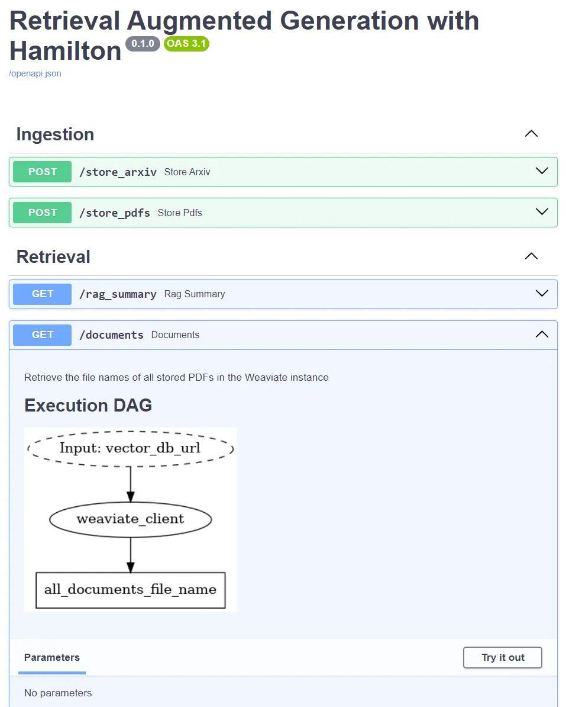

Off-the-shelf LLMs are excellent at manipulating and generating text, but they only know general facts about the world and probably very little about your use case. Retrieval augmented generation (RAG) refers not to a single algorithm, but rather a broad approach to provide relevant context to an LLM. As industry applications mature, RAG strategies will be tailored case-by-case to optimize relevance, business outcomes, and operational concerns.


> crosspost from https://blog.dagworks.io/p/retrieval-augmented-generation-reference-arch

<!--truncate-->

In this post, we provide a reference RAG architecture and discuss design decisions for each component. It’s ready for use, and will scale with your needs. Specifically, we’ll cover how to:

* Write ingestion and retrieval dataflows using [Hamilton](https://hamilton.dagworks.io/en/latest/)
* Build a backend with [FastAPI](https://fastapi.tiangolo.com/) + Hamilton backend
* Create a browser interface with [Streamlit](https://docs.streamlit.io/)
* Compute embeddings and generate text with the [OpenAI API](https://platform.openai.com/docs/api-reference/introduction)  
* Use and manage a [Weaviate](https://weaviate.io/developers/weaviate) vector store
* Build a containerized app using [Docker](https://docs.docker.com/reference/)

> Find the code on [GitHub](https://github.com/DAGWorks-Inc/hamilton/tree/main/examples/LLM_Workflows/retrieval_augmented_generation)
> This publication extends our previous [PDF Summarizer](https://blog.dagworks.io/p/containerized-pdf-summarizer-with)

## What is RAG and why do you need it?
Large language models (LLMs) learn to write coherent sentences by being exposed to enormous corpora of texts. In the process, the model stores facts about the world. However, determining what it knows or what it doesn’t is still a key theoretical challenge. The above generally describes *pre-trained*, *foundational* or *base* models, which are models not yet refined for a particular use-case (see model card of [bert-base-uncased](https://huggingface.co/bert-base-uncased) for details). For instance, GPT stands for *generative pre-trained transformer*, and ChatGPT is a fine-tuned version for chat applications.

A primary concern for LLM applications, outside of creative work, is the factual correctness of answers. This challenge can be mitigated by adopting one or many of the following techniques:

* **Fine-tuning** consists of further training a pre-trained model on curated examples for a specific task. The model learns domain-specific language and facts*, which improves the quality of embeddings and text generation relative to the domain (e.g., insurance, health). 

* **Instruction-tuning** is a form of fine-tuning that uses instruction-answer pairs. The model learns *how* to respond to queries (summarize, make a list, think step by step, etc.). Models labeled as *chat* (e.g., [llama-2-7b-chat](https://huggingface.co/meta-llama/Llama-2-7b-chat)) are great for general human interaction, and can be further fine-tuned to your domain.

* **Retrieval augmented generation (RAG)** is a multistep process to retrieve information relevant for a query, and pass it to the LLM as context to generate an answer. RAG is the most flexible approach for adding and updating knowledge since it only requires to change the available sources (e.g., files, internet pages) rather than updating the LLM.

Looking forward, retrieval will continue to be a key architectural component of LLM applications because editing LLM knowledge directly is an unsolved problem. Fine-tuning, in most cases, should be a later concern since it would also improve your RAG strategy if you have one in place. Furthermore, the LLM is the most likely component to be improved upon and replaced, requiring fine-tuning again. For these reasons, we suggest starting with an off-the-shelf LLM and implementing your own RAG system as a first step to improve the knowledge your LLM operates over.

## Introducing Hamilton

[Hamilton](https://hamilton.dagworks.io/en/latest/) is a declarative micro-framework to describe [dataflows](https://en.wikipedia.org/wiki/Dataflow) in Python. Its strength is expressing the flow of data and computation in a straightforward and easy to maintain manner (much like dbt does for SQL). It has minimal dependencies and can run anywhere Python runs, meaning the same code will work in development notebooks, scripts, Spark clusters, or production web-services. Hamilton is not a new framework (3.5+ years old), and has been used for years in production modeling data & machine learning dataflows; and it extends nicely to modeling LLM workflows!


The picture above encapsulates the function-centric declarative approach of Hamilton. The function’s name is tied to its outputs and its arguments define what data it depends on. This allows Hamilton to read functions found in a module and automatically generate the DAG to be executed. This paradigm incentivizes developers to write small modular functions instead of scripts or larger functions, without sacrificing iteration speed.

As a result, it is easier to:
* Write and maintain custom application logic
* View operation lineage and debug results   
* Update components of your stack
* Reuse function implementations across contexts (e.g., notebook, pipeline, web service)

> If you are new to Hamilton, feel free to visit our interactive browser demo at
https://www.tryhamilton.dev/

## Building a modular RAG application


Our example RAG application allows users to import PDF files, extract and store the text chunks, and query the system. These different operations are implemented as dataflows with Hamilton and are exposed via FastAPI endpoints. The backend communicates with OpenAI to embed documents and generate answers, and uses a local Weaviate vector store instance to store and retrieve documents. The frontend is built with Streamlit and exposes the different functionalities via a simple web user interface (UI). Everything is packaged as containers with `docker compose`, so you can run it anywhere Docker runs.

> Find the example on [GitHub](https://github.com/DAGWorks-Inc/hamilton/tree/main/examples/LLM_Workflows/retrieval_augmented_generation)

Let’s walk through its structure:

```title="Directory structure"
.
├── README.md
├── .env
├── build_app.sh
├── docker-compose.yaml
├── backend
│   ├── Dockerfile
│   ├── requirements.txt
│   ├── __init__.py
│   ├── ingestion.py
│   ├── retrieval.py
│   ├── server.py
│   ├── vector_db.py
│   └── docs
│       ├── documents.png
│       ├── rag_summary.png
│       ├── store_arxiv.png
│       └── store_pdfs.png
└── frontend
    ├── Dockerfile
    ├── requirements.txt
    ├── assets
    │   └── hamilton_logo.png
    ├── __init__.py
    ├── client.py
    ├── Information.py
    └── pages
        ├── 1_Ingestion.py
        └── 2_Retrieval.py
```

The repository is divided between the backend and the frontend, each with their own `Dockerfile` and `requirements.txt`. The backend has `server.py` which defines the FastAPI endpoints, and several `.py` files containing the Hamilton functions for the RAG workflow that interact with the vector store. You can think of each of these modules analogous to “chains” you’d find in Langchain. The frontend has `client.py` which handles `HTTP` requests to the backend and a [multipage Streamlit app](https://docs.streamlit.io/library/get-started/multipage-apps/create-a-multipage-app) using `Information.py`, `pages/1_Ingestion.py`, and `pages/2_Retrieval.py`.  The file `Introduction.py` is the app entrypoint and landing page (it’s not the clearest file name, but it defines how the page will be displayed within the Streamlit UI). 

## Hamilton dataflows a.k.a. “chains”
A RAG application can be divided into 3 main steps: ingestion, retrieval, and generation. Importantly, the ingestion step can be done at any time (e.g., continuously, periodically in batch, event-driven) while retrieval and generation always happen together in our case, i.e., when a user makes a query. For this reason, we implemented ingestion in `ingestion.py` and retrieval + generation in `retrieval.py`. This way, it would be trivial to reuse our Hamilton ingestion code in a macro-orchestrated pipeline for daily updates of, for example, any newly stored documents; see how to use Hamilton with [Airflow](../2023-06-28-airflow-hamilton/), [Prefect](../2023-07-25-prefect-hamilton/) for ideas on how that would work. 

Also, you’ll notice a separate `vector_db.py` which implements a small set of functionalities to interact with Weaviate. These functions are quite simple, but it allows us to integrate our vector store operations to the broader dataflow, have granular visibility over operations, and handle exceptions. It also enables use to replace Weaviate easily if we wanted to choose another vector store. See [our modular LLM stack post](../2023-07-11-modular-llm/) for more details on how to do that.

> Below we’ll discuss our dataflow design decisions, for a more hands-on explanation of Hamilton, see our [PDF Summarizer example](../2023-08-18-pdf-summarizer/).

### Ingestion flow
The ingestion flow allows users to upload arbitrary PDF documents, extract text content, chunk it, get embeddings from OpenAI, and store text chunks with their embedding in Weaviate. To make this demo more engaging, we added functionalities to directly search [arxiv.org](https://arxiv.org/) and store the selected scientific articles.

Below is the DAG for `ingestion.py`


Nodes with dotted outlines and the `Input:` prefix are external to the `ingestion.py` module and need to be provided to the `Hamilton Driver` as inputs at execution time. Doubled lines and the different arrow types describe [parallelizable code paths](https://hamilton.dagworks.io/en/latest/concepts/hamilton-function-structure/#dynamic-dags), which can be used to improve processing performance. Towards the bottom, `pdf_collection` collects all the chunks and stores them in a single [structured object in Weaviate](https://weaviate.io/developers/weaviate/tutorials/schema). 

Notice the path `local_pdfs` (near the center of the image) is part of; everything above is arXiv specific, and below is generic. This design decision allows us to reuse the same logic to store  PDFs from arXiv as any other PDF. As our application grows, we could store the arxiv functions in a separate `arxiv.py` module, and add code upstream of `local_pdfs` to load files from other sources. For example, you can visually imagine “cutting” the above diagram at `local_pdfs`, and then swapping in a different “implementation”, i.e. dataflow.

Also, we don’t do any sophisticated text processing, but we could easily add more functions between `raw_text` and `chunked_text`. By removing irrelevant text from PDFs (e.g., article references, markdown tables), we could reduce the amount of tokens to process, send to OpenAI, and to then store in our vector store. Adopting a smart processing strategy will both improve the quality of retrieval and lead to performance and cost optimization at scale. 

Changes to the ingestion dataflow (e.g., preprocessing, chunking, embedding model) should generally be followed by reprocessing all documents and recomputing embeddings. Visualizing downstream dependencies of changes is helpful to prevent breaking changes. For example, changing the embedding model will make stored documents incompatible by changing the notion of distance for retrieval and possibly having incompatible vector dimensions. Using the [Weaviate backup features](https://weaviate.io/developers/weaviate/configuration/backups) can make rollbacks easier and prevent having to re-compute embeddings and summaries, saving dollars and headaches.

### Retrieval flow
The retrieval flow can appear complicated at first, but essentially it starts by getting the text embedding for the user query and doing a [hybrid search](https://weaviate.io/developers/academy/zero_to_mvp/queries_2/hybrid) in Weaviate to find the most relevant stored chunks. For each chunk, it checks if a text summary was already generated; if not, the chunk is passed with a prompt to OpenAI’s chat model to generate a summary. The generated summaries of all chunks are collected and sorted according to the original Weaviate relevance ranking, to then be sent again to OpenAI to “reduce” summaries, i.e., make a summary of summary.

Here is the DAG for retrieval.py


A key decision was to specify prompt templates as function nodes (e.g., `prompt_to_summarize_chunk`, `prompt_to_reduce_summaries`) and not inputs (dotted outline). These prompt functions receive relevant context (e.g., text chunk), adds it to an f-string, and returns the formatted string. By storing them directly with the dataflow code, assessing behavior, versioning and debugging become much easier. We go into greater detail on how to manage prompts in [LLMOps: Production prompt engineering patterns with Hamilton](https://blog.dagworks.io/p/llmops-production-prompt-engineering).

As shown in the figure, the `rag_query` from the user only affects the initial chunk vector search and the `rag_summary` step which makes a “summary of summaries”. Accordingly, the function to summarize a chunk `chunk_with_new_summary` doesn’t depend on the user’s input allowing us to generate “generic” summaries for each chunk. This approach has the benefits of making chunk summaries reusable which can largely decrease cost and reduce latency. The downside is that the chunk summaries are less specific to the query and might decrease answer quality.

### Weaviate vector database
[Weaviate](https://weaviate.io/developers/weaviate) offers a specialized type of infrastructure to efficiently store and compare text embeddings (i.e., vectors) at scale. In the context of RAG, the LLM represents the semantic of chunks of text as vectors, and the vector database defines the notion of similarity or relevance. Vector databases come in [various forms](https://towardsdatascience.com/milvus-pinecone-vespa-weaviate-vald-gsi-what-unites-these-buzz-words-and-what-makes-each-9c65a3bd0696), but we decided to use Weaviate for a few reasons:

* **Classes and structured objects**. For each PDF, we create a `Document` object and `Chunk` objects and link them together with their respective properties `containsChunk` and `fromDocument`. With structured objects, we can retrieve a `Document` based on the relevance score of its `Chunks`; for example, by computing the `groupby sum` of the relevance of its chunks.

* **Vectors and data in one place**. Weaviate allows you to store the text along the vectors while other vector infrastructure only handle vectors. The latter requires managing and syncing a separate storage for documents which complexifies both ingestion and retrieval. Many data types are supported (e.g., strings, numbers, boolean, dates); we even store the full PDF of each `Document` as a `base64` blob.

* **Expressive retrieval**. Weaviate has a REST API for bulk operations and a GraphQL API for object retrieval. While learning GraphQL can be daunting, using it from the Python SDK is easy to approach (see example below). Additionally, many modes of retrieval are offered (vector, multimodal, keyword, etc.). For this RAG example, we used the [hybrid search](https://weaviate.io/developers/weaviate/search/hybrid), which combines vector and keyword search.

```python title="Weaviate GraphQL query"
response = (
    weaviate_client.query.get(
        "Chunk",  # Class
        [  # Properties to retrieve
            "chunk_index",
            "content",
            "summary",
            "fromDocument {... on Document {_additional{id}}}",  # Property of linked object
        ],
    )
    .with_hybrid(  # hybrid search parameters
        query=rag_query,  # user text query
        properties=["content"],  # properties of `Chunk` to search on (specified above)
        vector=query_embedding,  # user query embedding/vector
        alpha=hybrid_search_alpha,  # hybrid search parameter
    )
    .with_additional(["score"])  # compute relevance score
    .with_limit(retrieve_top_k)  # return top k objects
    .do()
)
```

### FastAPI server
[FastAPI](https://fastapi.tiangolo.com/) is used to define the server endpoints: `/store_arxiv`, `/store_pdfs`, `/rag_summary`, `/documents`, but for all of them, the code executed is actually handled by Hamilton. At startup, the server instantiates a `Hamilton Driver` with all the necessary Python modules (see [FastAPI Lifespan Events](https://fastapi.tiangolo.com/advanced/events/)). Then, the function body of FastAPI endpoint consists of accessing the global `Hamilton Driver`, calling `Driver.execute()` with the necessary variables, and returning a formatted response. Using Hamilton guarantees that the code powering your web service will run identically to your development notebooks or orchestrated pipelines.

```python title="FastAPI server snippet"
from contextlib import asynccontextmanager
from dataclasses import dataclass

import fastapi
import pydantic
from fastapi.responses import JSONResponse

from hamilton import driver


# define a global dataclass that is shared across endpoints
@dataclass
class GlobalContext:
    vector_db_url: str
    hamilton_driver: driver.Driver


@asynccontextmanager
async def lifespan(app: fastapi.FastAPI) -> None:
    """Startup and shutdown logic of the FastAPI app
    Above yield statement is at startup and below at shutdown
    Import the Hamilton modules and instantiate the Hamilton driver
    """
    # import the Python modules containing your dataflows
    import ingestion
    import retrieval
    import vector_db

    driver_config = dict()

    dr = (
        driver.Builder()
        .enable_dynamic_execution(allow_experimental_mode=True)  # to allow Parallelizable/Collect
        .with_config(driver_config)
        .with_modules(ingestion, retrieval, vector_db)  # pass our dataflows
        .build()
    )

    # make the variable global to reuse it within endpoints
    global global_context
    global_context = GlobalContext(vector_db_url="http://weaviate_storage:8083", hamilton_driver=dr)

    # execute Hamilton code to make sure the Weaviate class schemas is instantiated
    global_context.hamilton_driver.execute(
        ["initialize_weaviate_instance"], inputs=dict(vector_db_url=global_context.vector_db_url)
    )

    # anything above yield is executed at startup
    yield
    # anything below yield is executed at teardown


# instantiate the FastAPI app
app = fastapi.FastAPI(
    title="Retrieval Augmented Generation with Hamilton",
    lifespan=lifespan,  # pass the lifespan context
)

# define a POST endpoint
@app.post("/store_arxiv", tags=["Ingestion"])
async def store_arxiv(arxiv_ids: list[str] = fastapi.Form(...)) -> JSONResponse:
    """Retrieve PDF files of arxiv articles for arxiv_ids\n
    Read the PDF as text, create chunks, and embed them using OpenAI API\n
    Store chunks with embeddings in Weaviate.
    """
    global_context.hamilton_driver.execute(
        ["store_documents"],
        inputs=dict(
            arxiv_ids=arxiv_ids,
            embedding_model_name="text-embedding-ada-002",
            data_dir="./data",
            vector_db_url=global_context.vector_db_url,
        ),
    )

    return JSONResponse(content=dict(stored_arxiv_ids=arxiv_ids))
```

The snippet also shows that we execute the `Hamilton Driver` with `“initialize_weaviate_instance”` at startup to ensure the Weaviate schema exists and the vector store is available. Hamilton helps with keeping the endpoint functions brief and brings a nice separation of concerns. For example, if an error occurred, you can reproduce by using the logged request with Hamilton outside of FastAPI. If it succeeds, then the problem is likely related to the service and not the dataflow itself. We’ll discuss unit testing and integration testing in a future post, make sure to [subscribe](https://blog.dagworks.io/subscribe) to be notified!

A core feature of Hamilton is the automatically generated DAG visualization, which complements FastAPI's automated [Swagger UI documentation](https://fastapi.tiangolo.com/tutorial/metadata/). When running the example code, visit http://localhost:8082/docs to explore it yourself! FastAPI allows you to [add request examples](https://fastapi.tiangolo.com/tutorial/schema-extra-example/) to your code, which helps users learn your API and your team move faster as you develop and test things. 



### Streamlit frontend
[Streamlit](https://docs.streamlit.io/) allows you to build a user interface quickly using Python. Again, with the goal of modularity, we decided to build a [multipage Streamlit app](https://docs.streamlit.io/library/get-started/multipage-apps/create-a-multipage-app) with independent pages for information, ingestion, and retrieval. The file `client.py` defines the HTTP requests to interact with the server, which helps errors related to the client-server communication from those associated with the UI. An important consideration when using Streamlit is that the entire code is executed whenever a page is refreshed, so avoid having operations that are computationally intensive or incur costs (e.g., LLM API calls). 

The design of your search UI is a significant decision as it will largely [influence how people use your application](https://www.algolia.com/blog/ux/7-examples-of-great-site-search-ui/). For the ingestion page, we made sure to display the currently stored documents and provide feedback via a “spinner” widget during long ingestion operations. For the retrieval page, we exposed hybrid search parameters such as alpha and top k with informational tooltips to allow users to play around, but kept hidden the prompts used to summarize documents. After making a RAG query, the app will display the query, the answer, and the source chunks with their summary to allow you to reason over the answer. After more than one query, a slider will allow you to browse through your history of searches and compare answers to different queries. Semantic search has enabled news ways to retrieve information across documents, but finding the ideal UI for it remains an unsolved problem and we encourage you to iterate over it! 

### Docker services
Here’s the `docker-compose.yaml` file that manages three containers:
```yaml title="Docker compose file"
version: "3.4"
services:
  api:
    container_name: fastapi_server
    build: backend/.
    command: "uvicorn server:app --host 0.0.0.0 --port 8082"
    ports:
      - "8082:8082"
    environment:
      - OPENAI_API_KEY=${OPENAI_API_KEY}
      - DAGWORKS_API_KEY=${DAGWORKS_API_KEY}
    networks:
      - rag

  app:
    container_name: streamlit_app
    build: frontend/.
    command: "streamlit run --server.port 8080 --server.enableCORS false Information.py"
    ports:
      - "8080:8080"
    networks:
      - rag

  weaviate:
    image: cr.weaviate.io/semitechnologies/weaviate:1.19.8
    container_name: weaviate_storage
    command: --host 0.0.0.0 --port '8083' --scheme http
    ports:
    - 8083:8083
    restart: on-failure:0
    environment:
      QUERY_DEFAULTS_LIMIT: 25
      AUTHENTICATION_ANONYMOUS_ACCESS_ENABLED: 'true'
      PERSISTENCE_DATA_PATH: '/var/lib/weaviate'
      DEFAULT_VECTORIZER_MODULE: 'none'
      ENABLE_MODULES: ''
      CLUSTER_HOSTNAME: 'node1'
    networks:
     - rag

networks:
  rag:
```
This sets the main configuration of each service. For the FastAPI backend (api service), we pass the OpenAI key to the FastAPI backend and optionally set the DAGWorks API key. The Weaviate configuration is generated by their [interactive tool](https://weaviate.io/developers/weaviate/installation/docker-compose). Then, for each service the command section sets their entry point. They are all connected together via the `rag` [bridge network](https://docs.docker.com/network/drivers/bridge/). This allows services to communicate via a local URL of the following format `http://{container_name}:{port}` (e.g., `http://fastapi_server:8082`). You could want to have your vector store less tightly coupled if it is used by other applications.

When developing locally, containers can be accessed via` http://127.0.0.1:{port}` (try not to use [localhost](https://www.youtube.com/watch?v=98SYTvNw1kw)). You can keep containers running and call `docker compose up -d –build` to rebuild them as you make changes. In particular, this is useful to view frontend UI changes and test backend changes manually via the Swagger UI at http://localhost:8082/docs.  To see container logs, you can use `docker compose logs -f`  to see the logs from applications from their respective containers.

## Limitations
This example aims to be a reference architecture, and demonstrate how to build a RAG system and give you a solid basis to start your own project. However, it is by no means perfect. Here’s a list of limitations or areas we could improve upon:

**arXiv downloads**. The ingestion dataflow for arXiv files requires downloading the PDF of articles locally (on the FastAPI container) before subsequent steps. That is PDF files could fill up your docker container. A better approach would be to use the built-in [tempfile library](https://docs.python.org/3/library/tempfile.html) for `tempfile.NamedTemporaryFile` (note that tempfile is an area of active Python development and saw several changes since 3.8). For instance, PDF files sent to FastAPI (via Streamlit or POST) use temporary files via `streamlit.runtime.UploadedFile` and `fastapi.Uploadfile`.

**Weaviate duplicates**. Having duplicate sources in your vector store can reduce the quality of retrieval. You’d most likely prefer the “5 most-relevant, but somewhat distinct” chunks from the “5-most relevant and almost identical” chunks to generate your answer. However, the presented RAG system doesn’t prevent you from uploading duplicate documents during ingestion and finding duplicate / nearly files is a generally complex problem. One approach would be to first select the sets of chunks with very similar embeddings (potential duplicate) then use [fuzzy matching](https://github.com/seatgeek/thefuzz) (which is much less computationally efficient) on the chunk’s text to score potential duplicates. The downside is that it requires compute and can impact latency having to do this for the embedding of every chunk before deduplication.

**REST API conventions**. This example showcases a client-server architecture with the ingestion and retrieval of a RAG workflow. However, the design and the naming of the endpoints don’t follow the [REST best practices](https://restfulapi.net/resource-naming/). Following these conventions improves the semantics and the readability of your project, which is critical from proper downstream use. We will improve and update our API definition in our future post about testing. Make sure to subscribe to be notified when it we release it!

**Client-server communication**. You could use [Pydantic](https://docs.pydantic.dev/latest/) more extensively to define the FastAPI [requests and response types](https://fastapi.tiangolo.com/tutorial/response-model). This code could be used in both the `backend/server.py` and `frontend/client.py` to make development less error prone.

## Summary
We covered a lot in this post. Most importantly, we leave you with a reference architecture blueprint to get started with RAG applications. To use it, we suggest you should define your application’s dataflows, then create the endpoints for the operations supported by your server, and finally build the best-suited user interface for your application. Congratulations for getting through! Please bookmark this post, and feel free to revisit sections of this post as you make progress; if something isn’t clear please leave a comment/or suggest a PR to the repo to improve this example.

You might be interested by other posts in this series:
* [LLMOps: Production prompt engineering patterns with Hamilton](https://blog.dagworks.io/p/llmops-production-prompt-engineering)
* [Building a maintainable and modular LLM application stack with Hamilton](../2023-07-11-modular-llm)

## We want to hear from you!
If you’re excited by any of this, or have strong opinions, leave a comment, or drop by our Slack channel! Some links to do praise/complain/chat:

📣 join our community on [Slack](https://hamilton-opensource.slack.com/join/shared_invite/zt-1bjs72asx-wcUTgH7q7QX1igiQ5bbdcg#/shared-invite/email)  —  we’re more than happy to help answer questions you might have or get you started.

⭐️ us on [GitHub](https://github.com/dagworks-inc/hamilton).

📝 leave us an [issue](https://github.com/DAGWorks-Inc/hamilton/issues) if you find something.

📚 read our [documentation](https://hamilton.dagworks.io/en/latest/).

⌨️ [interactively learn](https://www.tryhamilton.dev/) about Hamilton in your browser.